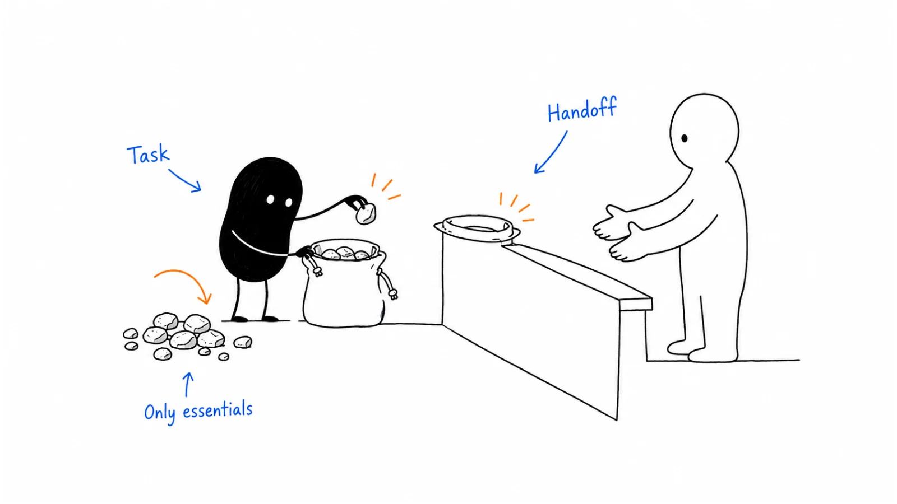

**Last reviewed:** 2026-08-30 · **Reading edit:** 2026-09-06

Every form field asks the reader to do a little more work. Keep the fields you genuinely need and make the next step clear. For chat, decide who answers, when they are available, and what happens if nobody can respond.

*Reading guide: define the reader's task → collect only what is needed → make the handoff clear.*

## Use this when

- Every page has a different form and none reuse known fields.
- Chat is staffed by marketing and creates “leads” sales will not take.
- Awareness content is gated like a demo.
- You are about to add a popup because bounce rate is high.

## Do not use this when

- The path is a scoped walkthrough. That is [demo request](demo-request.md).
- The path is a campaign promise. That is a [landing page](landing-page.md).
- You need scoring math. That is [lead scoring](../09-operations-pipeline-and-measurement/lead-scoring.md).
- Legal must set lawful basis. Get a qualified owner.

## A few useful terms

| Word | Meaning here |
|---|---|
| **Job of the form** | What happens after submit (route, send asset, start signup)—written first |
| **Progressive** | Ask the next unknown field, not the same six again |
| **Chat** | Human or bot that must have a job: answer, route, or get out of the way |
| **HDYHAU** | Open text on **declared-intent** forms only—see [measurement model](../09-operations-pipeline-and-measurement/measurement-model.md) |

## Keep this in mind

**The form is as short as the intent, and chat is not a second demo queue.** If you cannot write what happens in the first hour after submit, delete the form. If chat cannot hand a scoped request to the [demo](demo-request.md) SLA, it is decoration.

## How to do it

### Step 1: Define the purpose of the form

| Intent | Typical fields | After submit |
|---|---|---|
| Education / optional file | Work email, or nothing | Send the URL; do not notify sales |
| Event / webinar | Email, name | Register; nurture state = known |
| Hand-raise | [Demo request](demo-request.md) rules + HDYHAU | Human SLA |
| Signup | What activation needs | Product, not a BDR |

“Contact us” without a job becomes a junk drawer. Split it or kill it.

### Step 2: Use information you already have

If you already have role and company, do not ask again. Progressive profiling is a list and a memory, not a new form per PDF. [Lead scoring](../09-operations-pipeline-and-measurement/lead-scoring.md) already said awareness stays short.

### Step 3: Make the exchange worth the effort

Default ungated for [comparison](comparison-page.md), category, and [white paper](../03-brand-story-and-content/white-paper.md). Gate a working file only if someone will use the submit. Newsletter popups on first visit are refused on the [homepage](homepage.md); they are refused here too.

### Step 4: Give chat clear coverage and response rules

Allowed: answer a constraint (link to security), route a hand-raise into the demo SLA, tell a student they are in the wrong place. Not allowed: qualify budget in a widget, block the primary CTA, run after hours as if a human were there. Bot transcripts are not discovery.

### Step 5: Choose where to ask how buyers found you

Open text, no dropdown, on declared-intent only. Do not put it on every chat greeting. Categorize later. [Measurement model](../09-operations-pipeline-and-measurement/measurement-model.md).

## Worked example (illustrative)

| Surface | Job | Fields | Chat |
|---|---|---|---|
| Blog / education | Optional list | Email or none | Off |
| Comparison | Read | None | Link to security page if asked |
| `/walkthrough` | Hand-raise | Demo-request brief | Bot may open the same form, not a new qualify |
| Careers | Jobs | ATS | Off |

## Copy: interaction card (fill)

- URL / surface:
- Job after submit (one):
- Fields and why each exists:
- Fields we refuse:
- Chat: on / off / route-only:
- HDYHAU (yes only if declared intent):
- Owner and SLA:

Working file: [forms-and-chat.md](../../templates/forms-and-chat.md).

## Before you start

- [ ] Every live form has a written job and owner.
- [ ] Hand-raises use the [demo request](demo-request.md) path, not a generic contact.
- [ ] Known fields are not re-asked.
- [ ] Chat cannot cover the homepage door.
- [ ] Popups are off on first visit.
- [ ] Consent copy exists. This page is not that review.

## Metrics

| Metric | Diagnostic use |
|---|---|
| Completion by intent | Finish rate on *short* forms vs abandoned long ones |
| Wrong-queue | Chat “leads” sales marked junk |
| Re-ask rate | Return visitors asked the same fields again |
| Door block | Sessions where chat or popup hid the primary CTA |

Do not treat form-fill volume or chat engagement as conversion.

## Common mistakes

- One mega-form for every CTA.
- Chat as unofficial SDR.
- HDYHAU dropdowns on newsletters.
- Popup to “save the bounce.”
- Building a new form per campaign instead of a [landing page](landing-page.md) with one door.

## What to read next

The high-intent special case is [demo request](demo-request.md). Campaign URLs are [landing page](landing-page.md). Routing for non-hand-raisers is [lead scoring](../09-operations-pipeline-and-measurement/lead-scoring.md). State after a light fill is [lead nurture](../08-lifecycle-and-customer-marketing/lead-nurture.md). CRO as button theater is still planned; do not use this page as a lab.

## Sources and evidence boundary

This is an owner-maintained operating synthesis. Short-by-intent, progressive profiling, and high-value URLs as routing already live on [lead scoring](../09-operations-pipeline-and-measurement/lead-scoring.md) and [demo request](demo-request.md). Ungated defaults follow [lead nurture](../08-lifecycle-and-customer-marketing/lead-nurture.md) and [white paper](../03-brand-story-and-content/white-paper.md). Chat-vendor benchmarks are not method.

---

Copyright © 2026 Ivan Xu. All rights reserved. See the [copyright and reuse terms](../../LICENSE).

Canonical source: [github.com/weilun88313/B2B-Playbook](https://github.com/weilun88313/B2B-Playbook)
