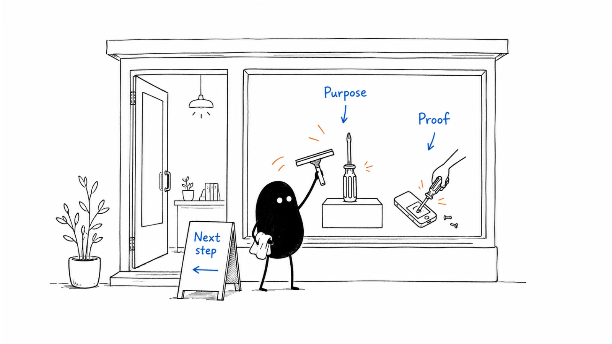

**Last reviewed:** 2026-09-02 · **Reading edit:** 2026-09-06

A new visitor should be able to understand what you sell, who it helps, and where to go next. Write those answers before designing the page. Add proof near the claims it supports and link to the detail buyers need for a closer look.

*Reading guide: what is this for? → why should I believe it? → what can I do next?.*

## Use this when

- A stranger cannot say the category, the seat, and the alternative after one useful scan.
- The hero is a slogan plus a stock photo, and sales still pastes the URL into evaluation threads hoping it explains itself.
- Navigation lists every SKU, every persona, and every campaign as if they were equal.
- Leadership wants a redesign because “it does not feel premium.”

## Do not use this when

- Positioning is empty. Finish [positioning](../02-product-marketing/positioning.md) first. A prettier hero will not invent a category.
- The work is one paid campaign’s promise. That is a landing page (still planned). Do not hijack `/` for a quarter’s ad.
- You need the comparison, pricing, or demo path itself. Those are sibling pages in this domain.
- The request is a visual-identity refresh with no message change.

## A few useful terms

| Word | Meaning here |
|---|---|
| **Scan** | What a stranger can name in ~10 seconds without scrolling the blog |
| **Door** | The one primary next step that matches the motion (signup, scoped demo, or a named page) |
| **Constraint link** | Security, deployment, or implementation—linked, not sold as the reason to buy |
| **Proof** | A dated, checkable fact a champion can defend—not a logo wall of companies you do not serve |

## Keep this in mind

**One scan, one door.** If the first screen cannot name category, seat, alternative, result, and next step, do not add a second CTA, a chat pop-up, or a newsletter modal. Confusion is not “giving options.”

## How to do it

### Step 1: Write the main answers before designing

A reader who never opens the blog should still identify:

- the product category;
- the buyer or operating context;
- the current alternative (including “keep doing this in a spreadsheet”);
- the business result;
- one next step;
- one likely operational constraint (security, data, deployment, integration, implementation).

If any line is still a superlative (“the leading platform”), you are not ready to design.

Then pass the same screen a second time in four lines that a stranger can complete without jargon:

- **Who it is for** (the seat and operating context);
- **What it is** (the product type a buyer would search—tool, workspace, marketplace, service—not “platform” unless that is true);
- **Why it is better** than the current alternative;
- **What to do next** (the door).

If those four lines contradict the 10-second scan, the scan is unfinished. Do not hide the product type so the page “feels premium.”

### Step 2: Match the next step to how customers buy

| Primary motion | Homepage door |
|---|---|
| **Self-serve inbound** | Signup / start, plus what they will be able to do in the first session |
| **Sales-assist inbound** | A scoped conversation or walkthrough of *their* job—not “book a 30-minute platform tour” |
| **Outbound** | The page still has to pass the scan. It is proof and a place to send, not the acquisition engine |

Two equal primary buttons (“Start free” and “Talk to sales”) usually mean the motion is unnamed. Pick one. Put the other in the header or below the fold.

### Step 3: Put evidence beside the claims it supports

Above the fold: one specific result or one named constraint you will not hide. Below: two or three dated proofs a champion can forward—not a logo salad of brands outside the ICP. If sales will not paste a proof block into a thread, it is decoration.

### Step 4: Link to deeper evaluation pages

The homepage introduces. It does not replace the [comparison page](https://b2-b-playbook.mintlify.app/playbooks/07-website-and-conversion/comparison-page), the [pricing page](https://b2-b-playbook.mintlify.app/playbooks/07-website-and-conversion/pricing-page), or the [demo request](https://b2-b-playbook.mintlify.app/playbooks/07-website-and-conversion/demo-request). Navigation should make those three findable in one click. A homepage that tries to be the comparison, the price book, and the blog is how buyers bounce to a competitor’s clearer URL.

### Step 5: Keep campaign promotions in proportion

A product launch, a webinar, or a seasonal offer may earn a thin banner. It does not replace the scan. If the only way to understand the product this month is the campaign hero, you rented `/` to marketing ops.

## Worked example (illustrative)

Ops lead. Alternative: a shared inbox plus a spreadsheet of SLAs. Motion: sales-assist.

| Field | Fill |
|---|---|
| Category + seat | Customer-ops queue for teams that still live in email—not an ITSM rollout |
| What it is | A shared queue for customer ops—not a help desk platform |
| Alternative | Shared inbox + spreadsheet. Named on the first screen. |
| Result | The lead can run the queue without forcing the team into a help desk they will not live in |
| Door | “Walk through *your* queue” — not “Request a demo” |
| Constraint link | Security / data residency in the header, not in the hero |
| Proof | One dated team that switched and kept using it; not a Fortune-100 logo we do not serve |

## Copy: homepage brief (fill)

- Category (the noun a buyer would search):
- Seat / operating context:
- What it is (product type, not a slogan):
- Current alternative, in their words:
- Why it is better (survives one more “so what?”):
- Business result (survives one more “so what?”):
- Primary door (one):
- Secondary path (header or below-fold only):
- Constraint we will link, not sell:
- Proof we will show (dated, checkable):
- Pages this homepage must not replace (comparison / pricing / demo):

Working file: [homepage.md](../../templates/homepage.md).

## Before you start

- [ ] Positioning worksheet is filled; this page does not invent a second story.
- [ ] A stranger can complete the 10-second test without opening the blog.
- [ ] The same screen answers who it is for, what it is, why it is better, and the door.
- [ ] The door matches [channel strategy](../04-channels-and-distribution/channel-strategy.md).
- [ ] There is one primary CTA above the fold.
- [ ] Proof is specific; logo walls that fail ICP are gone.
- [ ] Comparison, pricing, and the high-intent form are one click away.
- [ ] No newsletter pop-up on first visit. No chat that covers the door.
- [ ] The same structure can open outbound or a demo without contradiction.

## Metrics

| Metric | Diagnostic use |
|---|---|
| Scan pass rate | Five strangers (or five new hires) name category, seat, alternative, result, door |
| Door completion | Primary CTA clicks that reach the intended next page—not bounce-back |
| Sales paste | Times a seller drops `/` into an evaluation thread without adding a paragraph |
| Wrong-door rate | Self-serve signups that immediately ask for a human, or demo requests from seats you will never sell |

Do not treat bounce rate, time-on-page, or “brand lift” as a homepage score. A short visit that reaches pricing can be a win.

## Common mistakes

- Designing the hero before the scan is written.
- Two primary CTAs because sales and product could not agree.
- Hiding the alternative so the page “stays positive.”
- Replacing `/` with a campaign for a quarter.
- Listing every product because a second SKU exists on the roadmap.
- Measuring the page as a blog (sessions, scroll depth) instead of as a door.

## What to read next

A campaign click that must not land on `/` is a [landing page](https://b2-b-playbook.mintlify.app/playbooks/07-website-and-conversion/landing-page). The commercial number on the site is the [pricing page](https://b2-b-playbook.mintlify.app/playbooks/07-website-and-conversion/pricing-page). The page a champion forwards when a named tool is already in the deal is the [comparison page](https://b2-b-playbook.mintlify.app/playbooks/07-website-and-conversion/comparison-page). The form behind the sales-assist door is [demo request](https://b2-b-playbook.mintlify.app/playbooks/07-website-and-conversion/demo-request). If the scan still fails, go back to [positioning](../02-product-marketing/positioning.md). Which URLs to write after `/` is [content strategy](../03-brand-story-and-content/content-strategy.md).

## Sources and evidence boundary

This is an owner-maintained operating synthesis. The 10-second scan is the homepage test already written on [positioning](../02-product-marketing/positioning.md), from April Dunford’s public positioning work (*Obviously Awesome* / *Sales Pitch*). It is a **method**, not a claim about any current homepage—including the Help Scout teaching shape used there.

The second pass (who it is for, what it is, why it is better, product type on the hero) draws on Emily Kramer’s homepage-copy guidance ([MKT1, 2022-11-28](https://newsletter.mkt1.co/p/homepage-copy?ref=b2b-playbook)). The paid homepage wireframes and messaging templates behind that paywall are not reproduced here.

“One door matching the motion” is this library’s judgment, paired with [channel strategy](../04-channels-and-distribution/channel-strategy.md). Do not import consumer CRO folklore (button-color tests, Unbounce recipes) as B2B homepage method. A redesign case study is not your scan.

---

Copyright © 2026 Ivan Xu. All rights reserved. See the [copyright and reuse terms](https://github.com/weilun88313/B2B-Playbook/blob/main/LICENSE).

Canonical source: [github.com/weilun88313/B2B-Playbook](https://github.com/weilun88313/B2B-Playbook)
