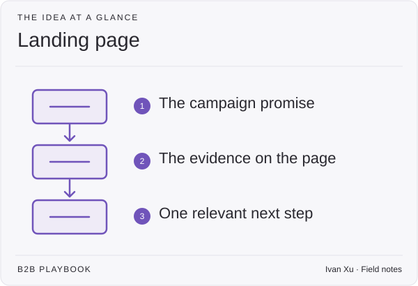

**Last reviewed:** 2026-08-30 · **Reading edit:** 2026-09-06

A landing page continues a promise made somewhere else, such as an ad, email, or event invitation. Keep that promise clear and give the visitor one relevant next step. Match the page to the campaign without inventing a different product story.

*Reading guide: the campaign promise → the evidence on the page → one relevant next step.*

## Use this when

- Paid or partner traffic arrives with a promise the homepage does not keep in the first screen.
- A webinar, launch, or comparison campaign needs a URL that will die when the campaign dies.
- Capture ads land on `/` and bounce.

## Do not use this when

- The promise is the standing story. That is the [homepage](homepage.md).
- You need the comparison or the price. Send them there; do not clone those pages under a UTM.
- The motion is unnamed and you are making pages to feel busy. [Channel strategy](../04-channels-and-distribution/channel-strategy.md) first.
- You want to A/B button color before the promise matches the ad.

## A few useful terms

| Word | Meaning here |
|---|---|
| **Promise** | The sentence the ad, email, or partner used—repeated above the fold |
| **Keep** | Proof or explanation that makes that sentence true on this URL |
| **Door** | The one next step this campaign is allowed to ask for |
| **Kill date** | When this URL stops being the destination |

## Keep this in mind

**The first screen must keep the promise that bought the click.** If the ad said “&#123;job&#125; for &#123;seat&#125; vs &#123;alternative&#125;,” the hero cannot say “welcome to the platform.” Message match is the page. Everything else is decoration.

## How to do it

### Step 1: Define the promise and next step

Complete: *people who saw &#123;source&#125; were promised &#123;sentence&#125;; this URL keeps it by &#123;proof or explanation&#125;; they do &#123;one action&#125;; we unpublish or redirect on &#123;date&#125;.* If you cannot finish that, you do not need a landing page.

### Step 2: Keep the product story consistent

Category, seat, alternative, result—same as [positioning](../02-product-marketing/positioning.md). The landing page **narrows** (this campaign’s trigger or offer). It does not reposition. Navigation can shrink; the constraint link should still exist if the promise touches security or implementation.

### Step 3: Match the action to visitor intent

| Traffic job | Door on this page |
|---|---|
| Capture (query, competitor, high-intent) | [Pricing](pricing-page.md), [comparison](comparison-page.md), or [demo request](demo-request.md)—not a newsletter |
| Creation (memory, video, thought-leadership amplify) | A readable point of view or a decision page; a fat form is usually wrong |
| Event / webinar | Register, then the asset—not a demo calendar in line one |

Two primary buttons mean two campaigns got taped together.

### Step 4: Keep the form proportionate to the request

Awareness register: email. Hand-raise: the [demo request](demo-request.md) rules (including HDYHAU if this *is* the hand-raise). Do not put a 12-field gate on a creation click and call the fills pipeline.

### Step 5: Review or retire the page after the campaign

When the campaign ends, redirect to the standing page that kept the same promise (homepage, comparison, or content URL). Orphan landing pages with old prices are how trust dies in search.

## Worked example (illustrative)

Paid search on “shared inbox vs queue for ops.” Capture.

| Field | Fill |
|---|---|
| Promise | Same as the query: queue reporting without a help-desk rollout |
| Keep | Alternative named; one dated proof; constraint link |
| Door | Comparison page + optional scoped walkthrough |
| Not the door | Newsletter, “platform tour,” careers |
| Kill date | 90 days or when the query is no longer on the capture list |

## Copy: landing-page brief (fill)

- Source (ad / partner / email) and the exact promise:
- How this URL keeps it (one proof or explanation):
- Door (one):
- Fields, if any—and why:
- Standing page we redirect to on kill date:
- Kill date:
- What we will not add (second CTA, pop-up, extra SKU):

Working file: [landing-page.md](../../templates/landing-page.md).

## Before you start

- [ ] Promise on the page matches the source in the first screen.
- [ ] Positioning is not rewritten.
- [ ] One primary door.
- [ ] Form length matches intent.
- [ ] Kill date and redirect target are written.
- [ ] This is not a clone of `/` with a UTM.
- [ ] Creation traffic is not forced through a capture form.

## Metrics

| Metric | Diagnostic use |
|---|---|
| Message match | Five people who saw only the ad can say the page kept it |
| Door completion | Primary action / unique visitors—not raw clicks |
| Wrong-door | Creation clicks that became junk form-fills |
| Orphan rate | Live landing URLs past their kill date |

Bounce rate is a hint that the promise broke. It is not the scoreboard. Button-color wins are not this playbook; tests that change a decision sit in [experimentation](../09-operations-pipeline-and-measurement/experimentation.md).

## Common mistakes

- Sending every ad to `/`.
- A new value prop that sales has never said.
- Gating a creation click.
- Letting the page live a year after the campaign.
- Calling this CRO and testing headlines before the promise matches.

## What to read next

The standing scan is the [homepage](homepage.md). The durable URLs a campaign should eventually earn are [content strategy](../03-brand-story-and-content/content-strategy.md). Whether you should have paid for the click is [paid media](../04-channels-and-distribution/paid-media.md). How to read the visit without last-click theater is [measurement model](../09-operations-pipeline-and-measurement/measurement-model.md). A named customer’s proof, when you have approval, is a [case study](../03-brand-story-and-content/case-study.md)—do not fake one on the landing page.

## Sources and evidence boundary

This is an owner-maintained operating synthesis. Message match (ad promise = page hero) is standard paid-capture hygiene, not a Unbounce recipe. One door and kill dates are this library’s judgment, paired with [homepage](homepage.md) and [paid media](../04-channels-and-distribution/paid-media.md). Consumer CRO lists (urgency clocks, fake social proof) are refused.

---

Copyright © 2026 Ivan Xu. All rights reserved. See the [copyright and reuse terms](../../LICENSE).

Canonical source: [github.com/weilun88313/B2B-Playbook](https://github.com/weilun88313/B2B-Playbook)
