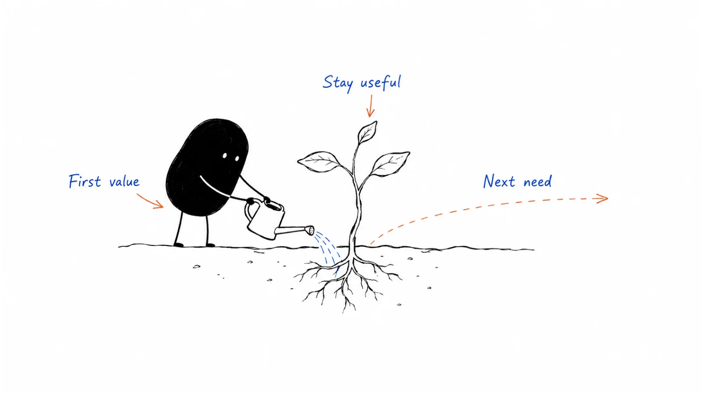

# 08 · Lifecycle & customer marketing

The work continues after a signup or a sale. Help people get started, answer their next question, recognise risks, and discuss renewals or expansion when there is a real reason.

**Status:** Domain guide published · 9 tactic playbooks published

**Last reviewed:** 2026-09-06

## Start here

- [Customer onboarding](customer-onboarding.md) — handoff and kickoff.
- [Lead nurture](lead-nurture.md) — understand the current question.
- [Renewal marketing](renewal-marketing.md) — review delivered value.

## Playbook map

| Guide | What it helps you do |
|---|---|
| [Customer success](customer-success.md) | How should people, process, and performance run the book after the sale? |
| [Customer onboarding](customer-onboarding.md) | How should first value be educated and implemented without mixing the two jobs? |
| [Onboarding communication](onboarding-communication.md) | What must a new customer know and do to reach first value in *messages*? |
| [CS-leadership ramp](cs-leadership-ramp.md) | What should a new CS executive actually do in 90 days? |
| [CS workspace](cs-workspace.md) | Which post-sale fields must exist so CS can see value, cadence, renewal, and risk? |
| [Revenue churn](revenue-churn.md) | How do we measure revenue leaving the book without letting net hide the leak? |
| [Lead nurture](lead-nurture.md) | How should a known person learn by state—before they are in-market? |
| [Expansion marketing](expansion-marketing.md) | When may additional value be introduced—on evidence, not on a launch calendar? |
| [Renewal marketing](renewal-marketing.md) | How should value be recognized and risk reduced before the commercial path? |

## Coming later

These topics are on the writing list. There is no article to open yet.

| Planned topic | Question to cover |
|---|---|
| Lifecycle email | Which event, state, or behavior should trigger which communication? |
| Customer education | Which knowledge helps users adopt the product and achieve outcomes? |
| Customer community | When can customers help one another learn, connect, and succeed? |
| Customer advocacy | How should willing customers participate without being overused? |
| Referral program | What value exchange can make trusted introductions repeatable? |
| Review program | How should authentic reviews be requested, governed, and activated? Buyer-visible listings live in [review sites](../04-channels-and-distribution/review-sites.md). |
| Win-back | When and how should an inactive or former customer be re-engaged? |

## Where to go next

Pick a guide above for the task you are working on, or browse [Operations, pipeline & measurement](../09-operations-pipeline-and-measurement/) for a related part of the work.

[Back to the playbook index](../README.md)

---

Copyright © 2026 Ivan Xu. All rights reserved. See the [copyright and reuse terms](../../LICENSE).

Canonical source: [github.com/weilun88313/B2B-Playbook](https://github.com/weilun88313/B2B-Playbook)
