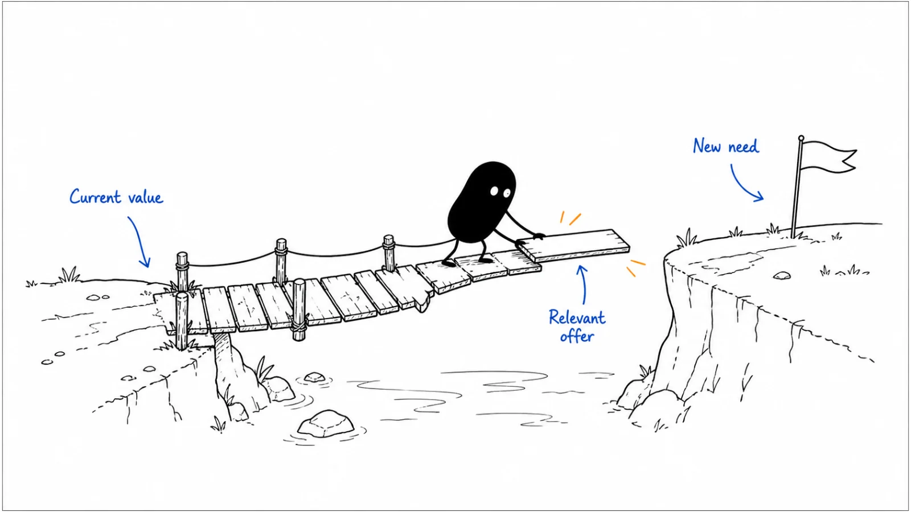

**Last reviewed:** 2026-08-30 · **Reading edit:** 2026-09-12

An existing customer may need another use case, more capacity, or a wider rollout. Start with evidence of value and a new need, then work with the account owner on a relevant offer. Do not treat the customer base as a list for every product announcement.

*Reading guide: value from today's use → evidence of another need → a relevant expansion offer.*

## Use this when

- New-logo quota is covering a leaking book and nobody will say so.
- CS and sales both “own expansion” and the customer hears two stories.
- Every QBR ends with a SKU, including accounts that never launched.
- Packaging created a second product and marketing wants a campaign to the whole base.

## Do not use this when

- There are no customers. Stay in [first ten](../01-strategy-and-buyers/first-ten-customers.md).
- You need who owns the book. That is [customer success](https://b2-b-playbook.mintlify.app/playbooks/08-lifecycle-and-customer-marketing/customer-success).
- You need the renewal clock. That is [renewal marketing](https://b2-b-playbook.mintlify.app/playbooks/08-lifecycle-and-customer-marketing/renewal-marketing).
- Gross churn is the fire. Fix onboarding and ICP before you sell more surface area.

## A few useful terms

| Word | Meaning here |
|---|---|
| **Realization** | They got the first job they bought. No realization, no expansion ask |
| **Trigger** | Dated evidence a second job is now expensive (usage wall, new seat, new constraint) |
| **Commercial owner** | The role paid for the expansion—written, not “we’ll figure it out” |
| **Survivor growth** | Expansion that makes net look fine while gross still leaks |

## Keep this in mind

**Do not expand an account that has not realized the first purchase.** If launch is still open, or they cannot name the result, another SKU is how you create contraction. [CS workspace](https://b2-b-playbook.mintlify.app/playbooks/08-lifecycle-and-customer-marketing/cs-workspace) must show realization before marketing writes a campaign.

## How to do it

### Step 1: Agree on who owns the conversation

Write the sentence [customer success](https://b2-b-playbook.mintlify.app/playbooks/08-lifecycle-and-customer-marketing/customer-success) already demands: *renewals live with ____; expansion lives with ____; they are paid on ____.* If both are paid on the same dollar, say so. If they conflict, stop the campaign until [sales compensation](../09-operations-pipeline-and-measurement/sales-compensation.md) is honest.

### Step 2: Look for a customer need

Allowed triggers (need two that a stranger could check):

- They hit a usage or seat wall they already understood on the [pricing page](../07-website-and-conversion/pricing-page.md)
- A new seat or team asked for the same job
- A dated constraint (security, region, product line) the first SKU does not cover
- They asked

Not a trigger: “we launched a module,” “the AE is behind,” “they opened a newsletter.”

### Step 3: Offer the next useful use case

One additional job, one owner in their committee, one next step (scoped conversation or a [case study](../03-brand-story-and-content/case-study.md) from a similar expand). [Positioning](../02-product-marketing/positioning.md#step-8-position-the-way-you-sell) already says add-ons are for accounts that own the lead product—not a second standalone category story.

### Step 4: Review losses as well as expansion

If expansion is the only reason net looks healthy, say that in [GTM planning](../09-operations-pipeline-and-measurement/gtm-planning.md). Review upgrade revenue alongside departing customers so growth in healthy accounts does not hide problems elsewhere.

### Step 5: Keep the outreach relevant to each account

Do not email the whole customer list a new SKU. Segment on realization + trigger. A base-wide “what’s new” is [lifecycle](https://b2-b-playbook.mintlify.app/playbooks/08-lifecycle-and-customer-marketing) later—and even then it is education, not a close.

## Worked example (illustrative)

Ops queue product. Second SKU = audit log / enterprise admin.

| Field | Fill |
|---|---|
| Commercial owner | AM, paid on expansion. CSM paid on retention. Written. |
| Trigger we will honor | Security questionnaire appeared, or a second queue asked for the same job |
| Trigger we refuse | “New module” email to everyone who launched |
| Proof | One [case study](../03-brand-story-and-content/case-study.md) of a team that added admin after realization |
| Will not expand | Accounts still in onboarding, or at-risk on the CS queue |

## Copy: expansion card (fill)

- Who is paid for expansion / who is paid for renewal:
- Realization rule (what must be true):
- Triggers we will honor (checkable):
- Triggers we refuse:
- Next job we are allowed to introduce this quarter (one):
- Segment (not the whole base):
- Gross vs net sentence we will not hide:

Working file: [expansion-marketing.md](../../templates/expansion-marketing.md).

## Before you start

- [ ] Commercial owner is written and does not secretly fight CS pay.
- [ ] Realization is visible in [CS workspace](https://b2-b-playbook.mintlify.app/playbooks/08-lifecycle-and-customer-marketing/cs-workspace).
- [ ] Triggers are dated and checkable.
- [ ] One next job, not a catalog.
- [ ] At-risk and unlaunched accounts are excluded.
- [ ] Gross is reported next to any expansion celebration.

## Metrics

| Metric | Diagnostic use |
|---|---|
| Expansion on realized accounts | Upgrades where first-value was already dated |
| Expansion on leaking accounts | Upgrades we should not have asked for |
| Gross vs net | Whether expansion is covering cancel + contraction |
| Ask quality | Expansion conversations the customer initiated or clearly triggered |

Do not treat “expansion pipeline from a product-launch email” as health.

## Common mistakes

- Expanding before launch.
- Two owners, two stories.
- Base-wide SKU blast.
- Using expansion to paper over gross churn.
- A second category story for an add-on.

## What to read next

The clock that must not be a surprise is [renewal marketing](https://b2-b-playbook.mintlify.app/playbooks/08-lifecycle-and-customer-marketing/renewal-marketing). The leak expansion must not hide is [revenue churn](https://b2-b-playbook.mintlify.app/playbooks/08-lifecycle-and-customer-marketing/revenue-churn). Who runs the book is [customer success](https://b2-b-playbook.mintlify.app/playbooks/08-lifecycle-and-customer-marketing/customer-success). How the second product is positioned is [position the way you sell](../02-product-marketing/positioning.md#step-8-position-the-way-you-sell). Named-account expansion still uses [account planning](../06-account-field-and-partner/account-planning.md).

## Sources and evidence boundary

This is an owner-maintained operating synthesis. Realization-before-ask and “do not let expansion hide gross” are this library’s judgments, already implied by [customer success](https://b2-b-playbook.mintlify.app/playbooks/08-lifecycle-and-customer-marketing/customer-success), [CS workspace](https://b2-b-playbook.mintlify.app/playbooks/08-lifecycle-and-customer-marketing/cs-workspace), and [revenue churn](https://b2-b-playbook.mintlify.app/playbooks/08-lifecycle-and-customer-marketing/revenue-churn) (Kellblog-shaped gross vs net). ITSMA/ABM “land and expand” slogans are not a method. This page is not a packaging or revenue-recognition opinion.

---

Copyright © 2026 Ivan Xu. All rights reserved. See the [copyright and reuse terms](https://github.com/weilun88313/B2B-Playbook/blob/main/LICENSE).

Canonical source: [github.com/weilun88313/B2B-Playbook](https://github.com/weilun88313/B2B-Playbook)
