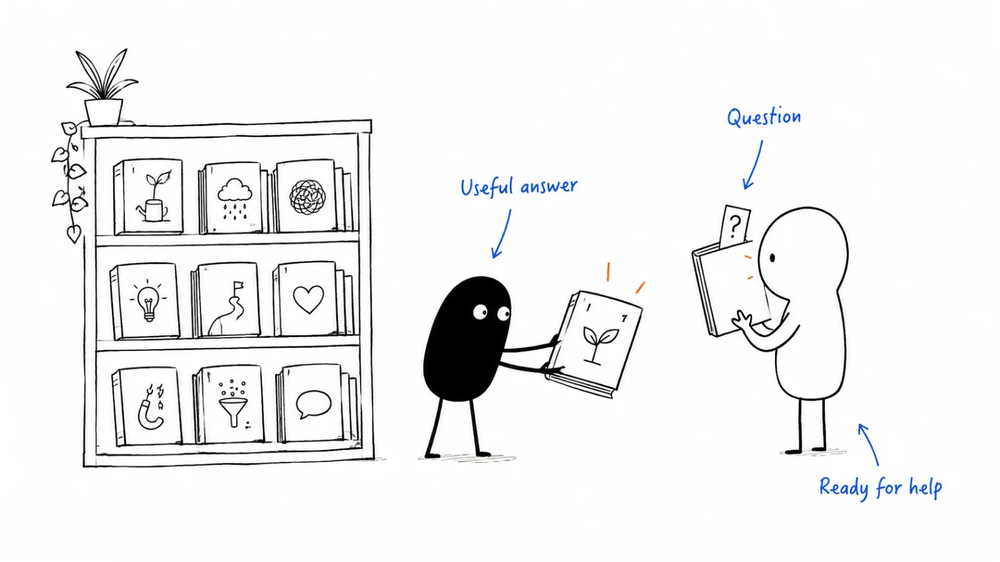

**Last reviewed:** 2026-08-30 · **Reading edit:** 2026-09-12

Some people are interested but not ready to buy. Help them answer the next question instead of sending the same sales request on a timer. Use what they have asked or done to choose useful content, and hand over to a person when fit and intent are clear.

*Reading guide: understand the current question → send a useful answer → recognise when help is wanted.*

## Use this when

- Demo no-shows and “send me information” pile up, and the only follow-up is a calendar link every week.
- Marketing automation has five nurtures and nobody can say which state each person is in.
- Gated PDFs fill the database; sales refuses the names; marketing calls them MQLs.
- Leadership wants “a nurture stream” because the webinar list is large.

## Do not use this when

- They already raised a hand. That is [demo request](../07-website-and-conversion/demo-request.md) speed-to-lead, not a drip.
- They are a customer. That is [onboarding communication](https://b2-b-playbook.mintlify.app/playbooks/08-lifecycle-and-customer-marketing/onboarding-communication) or later lifecycle pages.
- You have no decision pages to send. Write [content strategy](../03-brand-story-and-content/content-strategy.md) first; a drip cannot invent the comparison.
- Volume is small enough that a founder can write one useful note. Do that.

## A few useful terms

| Word | Meaning here |
|---|---|
| **State** | What is true of them now (known, evaluating, blocked, not-now)—not a persona name |
| **Signal** | A behavior or date that changes the state (pricing visit, job change, they asked to pause) |
| **Useful send** | A URL or artifact they can use without buying you |
| **Qualification based on weak signals** | Points for opens and a meeting ask that ignores state |

## Keep this in mind

**Nurture the state, not the calendar.** If the next email would be the same on day 3 and day 90, you have a broadcast. If every email asks for a meeting, you have outbound with extra steps. The 95% who are out-of-market need memory and teaching; the 5% who just hit pricing need a human, not email seven.

## How to do it

### Step 1: Define customer situations before messages

Minimum set:

| State | They are… | We send | We do not send |
|---|---|---|---|
| **Known, not evaluating** | Gave an email for a reason that was not a demo | Decision-page links, founder/POV, one useful artifact | Meeting asks, “just checking in” |
| **Evaluating** | Comparison, pricing, or security questions | The page that answers the last question they asked | A generic “platform overview” |
| **Blocked / not now** | Said timing, or went dark after a real look | A dated reason to return (revisit, new constraint page) | Weekly cadence |
| **Hand-raise** | Asked for a walk | Nothing automated except confirm + SLA | A nurture |

If you cannot put a person in one row, do not automate them.

### Step 2: Choose when a form is justified

Refine Labs / modern demand practice: stopping the market at a form to “generate MQLs” trains junk and hides whether the asset was any good. Default: the [comparison](../07-website-and-conversion/comparison-page.md) and category pages are public. Gate a working file or a data cut only when sales will actually use the submit—and even then, do not call the fill a meeting.

Heinz-style ops language still applies: **entry criteria, owner, next action.** A nurture without an exit is a list tax.

### Step 3: Respond to questions and behaviour

Good triggers: they hit pricing; they asked a constraint question; a [buying signal](../05-outbound-and-prospecting/buying-signals.md) changed the week; they replied “not now, after Q3.” Bad triggers: opened email two; attended a webinar once; downloaded anything.

One send per trigger, then silence unless the state changes. Frequency caps exist so you do not become the vendor they mute.

### Step 4: Hand over when a person can help

Fit without intent stays in known-not-evaluating. Intent without fit gets a polite redirect. Both together: notify per [lead scoring](../09-operations-pipeline-and-measurement/lead-scoring.md), do not wait for the drip to finish.

### Step 5: Measure progress beyond email opens

The question is: did a known person reach a decision page, a scoped request, or an honest not-now? Opens and click-throughs are diagnostics. They are not the program.

## Worked example (illustrative)

Webinar list of ops leads. Comparison page exists. Demo form is scoped.

| Field | Fill |
|---|---|
| States we will run | Known-not-evaluating; evaluating; not-now. No “MQL nurture.” |
| Default send | Monthly: one scene + comparison or constraint URL. Product name optional. |
| Trigger upgrade | Pricing or `/walkthrough` visit → human SLA, drip pauses |
| Gate | None on comparison. Optional: queue-template working file, one field (work email) |
| Exit | Hand-raise, disqualify, or “pause until &#123;date&#125;” |
| Will not do | Seven-email “value then ask.” Points for webinar attendance alone. |

## Copy: nurture-state card (fill)

- State name and entry rule:
- What we send (URL or artifact—not a meeting):
- Trigger that upgrades or pauses:
- Owner when a human is required:
- Exit criteria:
- Frequency cap:
- What we refuse to gate:

Working file: [lead-nurture.md](../../templates/lead-nurture.md).

## Before you start

- [ ] Decision pages exist; this program is not a substitute for them.
- [ ] Every person can be placed in one state.
- [ ] Hand-raisers are excluded from the drip.
- [ ] Default assets are ungated.
- [ ] A trigger can pause or escalate without waiting for “email 7.”
- [ ] Consent and preference center exist. This page is not privacy counsel.
- [ ] Sales can finish “I use this stream when _____.”

## Metrics

| Metric | Diagnostic use |
|---|---|
| State-exit quality | People who left for a scoped request, a dated not-now, or a disqualify—not for unsubscribe after spam |
| Decision-page use | Known people who hit comparison/pricing *after* a send, then a conversation |
| Human-handoff SLA | Escalations that were actually taken |
| Mute / unsub | Streams we correctly killed |
| MQL-from-nurture | Inquiries sales accepted; compare later outcomes to check whether acceptance reflects a useful buying conversation |

Do not treat email open rate, drip completion, or “nurtured MQLs” as success.

## Common mistakes

- One drip for every list.
- Gating the only useful page.
- Meeting ask in every send.
- Scoring webinar attendance into a sales queue.
- Never writing “not now.”
- Building nurture before the comparison URL exists.

## What to read next

The pages you are allowed to send are [content strategy](../03-brand-story-and-content/content-strategy.md). The form that must not enter this stream is [demo request](../07-website-and-conversion/demo-request.md); how much a quieter surface may collect is [forms and chat](../07-website-and-conversion/forms-and-chat.md). When a score may notify a human is [lead scoring](../09-operations-pipeline-and-measurement/lead-scoring.md). Paying to stay visible to the 95 is [paid media](../04-channels-and-distribution/paid-media.md) or [LinkedIn organic](../04-channels-and-distribution/linkedin-organic.md)—not a longer drip. After they buy, leave this page: [customer onboarding](https://b2-b-playbook.mintlify.app/playbooks/08-lifecycle-and-customer-marketing/customer-onboarding).

## Sources and evidence boundary

This is an owner-maintained operating synthesis.

- **Make useful resources accessible; compare form activity with buyer conversations and referrals tracking may miss.** Refine Labs public demand essays and tactics notes. Agency point of view; not a command to delete every gate.
- **State, entry, owner, next action.** Heinz Marketing’s public alignment / operating-template language—applied here as ops hygiene, not as a purchased worksheet.
- **95-5: do not treat out-of-market people as late-funnel leads.** LinkedIn B2B Institute. For readers who are not considering a purchase, useful education may be more appropriate than repeated demo invitations.
- Seven-email drip folklore (HubSpot gallery, “value-value-ask”) is the **anti-pattern** this page refuses. It is not cited as method.

---

Copyright © 2026 Ivan Xu. All rights reserved. See the [copyright and reuse terms](https://github.com/weilun88313/B2B-Playbook/blob/main/LICENSE).

Canonical source: [github.com/weilun88313/B2B-Playbook](https://github.com/weilun88313/B2B-Playbook)
