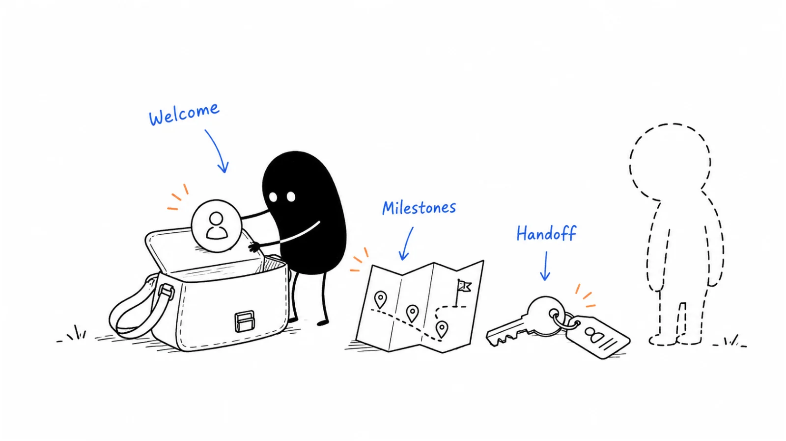

**Last reviewed:** 2026-08-30 · **Reading edit:** 2026-09-12

New customers should know who to contact, what happens next, and what they need to prepare. Put the essentials in one welcome packet, then adapt the follow-up to their project. Keep routine messages separate from account-specific decisions.

*Reading guide: welcome and contacts → milestones and responsibilities → progress and handoff.*

## Use this when

- Implementation is staffed, but the customer cannot name who to email or what is due next week.
- Welcome sequences fire on “user created” while the buying committee has not met you.
- Onboarding ends and the CSM starts from zero because nothing was written down.
- You are about to paste a membership welcome-email template into HubSpot.

## Do not use this when

- There is no signed customer. Stay in [first ten](../01-strategy-and-buyers/first-ten-customers.md).
- You still mix education and implementation in one job. Split that in [customer onboarding](https://b2-b-playbook.mintlify.app/playbooks/08-lifecycle-and-customer-marketing/customer-onboarding) first.
- The product is truly self-serve and the only job is in-app empty states. Do not invent a professional-services packet. Define the relevant states before configuring [lifecycle email](lifecycle-email.md).

## Keep this in mind

**The customer should be able to answer, from one document: who we are, what we asked them, what happens by when, and where help lives.** If that requires a tribal Slack thread, you do not have onboarding communication. You have hope.

## How to do it

### Step 1: Separate standard messages from account-specific work

**Every new customer (product-shaped):** welcome that matches how they actually start (seat created vs company signed), a nudge if they never take the first action, first-run guidance, empty states that teach instead of looking broken.

**This customer (human-shaped):** first meeting on the calendar, a packet with *their* names and dates, an intake due **before** or **on** that call, a named celebration when an early milestone you both defined actually happens.

Do not automate the packet as if it were a drip. Do not staff a CSM to write empty-state copy.

### Step 2: Prepare one useful welcome packet

A working packet is:

1. **People** — named points of contact and what each is for (implementation vs book vs support).
2. **Intake** — what you still need from them (who uses it, goals, current stack, migration, why they bought). Sales notes are a start; they are not the intake. Due date on the first call.
3. **Timeline** — length, date range, each row: due date, the meeting or task, the **objective** (what “done” looks like). Guidelines, not a punishment calendar—they may go faster.
4. **Help** — trainings to complete, articles to read, how to reach **support** (hours, what CS will not ticket) versus the named human.

If a fifth section is a brand story, put it last or cut it. The packet is a path, not a magazine.

### Step 3: Use the packet during kickoff

Before you talk: confirm the people who must be there (including IT if migration is real). On the call: introductions with roles and locations; timeline and intake due date; where help lives; their current process and the outcome they bought; next steps dated. Walk the [order form](https://b2-b-playbook.mintlify.app/playbooks/08-lifecycle-and-customer-marketing/customer-onboarding) as onboarding already requires. The agenda is a memory aid. The CRM still holds what sales knew.

### Step 4: Confirm completion and the ongoing relationship

If a specialist ran implementation and a CSM/AM owns the book, the customer gets: new person (cc’d), what they own, how to get support, that the work to date is documented. The **internal** note is the real asset: contacts and how to reach them, decision-maker who is not in the tool daily, what the company does and how it makes money, goals hit, challenges left, remaining asks, extra training or SKUs already named.

A “welcome to your CSM” email with no note is how QBRs become archaeology.

## Worked example (illustrative)

Sales-assist ops tool. Six-week assisted onboarding. Not a HubSpot import guide.

| Piece | Fill |
|---|---|
| Automation | Company signed → welcome to the *admin*, not every end user. Inactivity nudge only if they have a login. Empty states: “import a queue,” not a feature tour. |
| Packet | CSM + implementation lead + support hours. Intake due at kickoff. Timeline: kickoff / stack review / UAT / go-live, each with an objective. Help: two articles, support for defects, CSM for commercial. |
| First call | Buyer + admin + IT if migrating. Confirm promised outcome from the AE note. |
| Handoff | Implementation cc’s CSM. Internal note: advocate in ops, economic buyer in finance, remaining: SSO. |

## Copy: communication one-pager (fill)

- Automation that fires for every logo (and what must **not** auto):
- Packet: people · intake due · timeline rows · help vs support:
- First-call must-have seats:
- Early milestone we will celebrate (and how):
- Customer-facing handoff: new owner, scope, support path:
- Internal handoff note: contacts · decision-maker · goals hit · leftover work:

Working file: [onboarding-welcome.md](../../templates/onboarding-welcome.md). The journey and clocks stay in [customer onboarding](https://b2-b-playbook.mintlify.app/playbooks/08-lifecycle-and-customer-marketing/customer-onboarding).

## Before you start

- [ ] Packet matches the signed scope, not a generic “community” letter.
- [ ] Intake has a due date tied to the first call.
- [ ] Timeline rows have objectives, not only meeting names.
- [ ] Support hours and “what CS will not ticket” are written.
- [ ] Automation cannot fire before the company is actually a customer.
- [ ] If two humans own the journey, the customer and the CRM both get a handoff.
- [ ] No pasted membership email as the live sequence.

## Metrics

| Metric | Diagnostic use |
|---|---|
| Intake returned before or at kickoff | Whether the packet is real |
| Customer can name next due date without asking Slack | Packet vs folklore |
| Handoff notes complete when specialist exits | Book owner starting from zero |
| Automation unsubscribes / “who is this” replies | Sequence fired on the wrong event |

Do not count packets designed, or resemblance to a Pavilion welcome template, as communication.

## Common mistakes

- Welcome drip on user-signup while the contract is still in legal.
- Packet with headshots and no timeline objectives.
- Intake that duplicates the CRM and ignores why they bought.
- First call with no IT when migration is on the order form.
- Handoff email, empty internal note.
- Celebrating “logged in” as a milestone they did not care about.
- Copying another company’s email—including a member checklist with HubSpot help-center examples—as if it were your motion.

## What to read next

The work those messages sit on is [customer onboarding](https://b2-b-playbook.mintlify.app/playbooks/08-lifecycle-and-customer-marketing/customer-onboarding). Who owns the book after handoff is [customer success](https://b2-b-playbook.mintlify.app/playbooks/08-lifecycle-and-customer-marketing/customer-success). A new CS leader’s first 90 days are [CS-leadership ramp](https://b2-b-playbook.mintlify.app/playbooks/08-lifecycle-and-customer-marketing/cs-leadership-ramp). Named-account depth is [account planning](../06-account-field-and-partner/account-planning.md).

## Sources and evidence boundary

This is an owner-maintained operating synthesis. It is not a licensed onboarding product, not a HubSpot how-to, and not an email legal review.

Automation versus per-logo work, a four-part packet (people, intake, timeline with objectives, help), a first-call agenda that uses that packet, and a customer-facing plus internal handoff when the specialist leaves are distilled from an operator customer-onboarding packet (Pavilion-circulated template). That file is a **method prompt**, not a source to copy. Its sample emails, HubSpot help-article titles, gift-to-the-office ideas, and placeholder dates are not imported. Pavilion is listed in [RESOURCES.md](../../RESOURCES.md); membership is not required.

---

Copyright © 2026 Ivan Xu. All rights reserved. See the [copyright and reuse terms](https://github.com/weilun88313/B2B-Playbook/blob/main/LICENSE).

Canonical source: [github.com/weilun88313/B2B-Playbook](https://github.com/weilun88313/B2B-Playbook)
