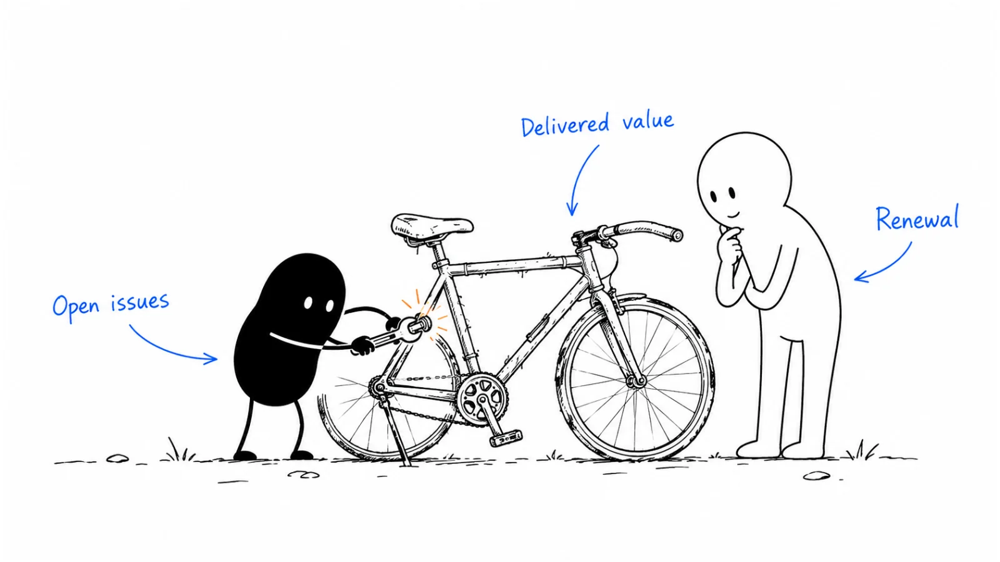

**Last reviewed:** 2026-08-30 · **Reading edit:** 2026-09-12

A renewal is easier to discuss when the customer can see what they have achieved. Start before the contract deadline, gather a short record of value and unresolved issues, and make the commercial steps clear. Work with the account owner rather than sending a generic reminder.

*Reading guide: review delivered value → resolve open issues → agree on the renewal path.*

## Use this when

- Renewals surface as a surprise in the last month.
- Marketing’s only customer email is a promo code.
- CS can see risk and has no written value packet a champion can forward upstairs.
- Finance asks why logos churn after “green” health scores.

## Do not use this when

- There are no customers or no terms. Stay in [first ten](../01-strategy-and-buyers/first-ten-customers.md) or write the contract fields first.
- Launch never happened. That is [customer onboarding](https://b2-b-playbook.mintlify.app/playbooks/08-lifecycle-and-customer-marketing/customer-onboarding).
- You need expansion of a second job. That is [expansion marketing](https://b2-b-playbook.mintlify.app/playbooks/08-lifecycle-and-customer-marketing/expansion-marketing).
- You need the churn math. That is [revenue churn](https://b2-b-playbook.mintlify.app/playbooks/08-lifecycle-and-customer-marketing/revenue-churn).

## A few useful terms

| Word | Meaning here |
|---|---|
| **Horizon** | How many days before end-of-term the commercial path starts (and who is notified) |
| **Value packet** | What they achieved in *their* units—dated, not a product changelog |
| **Risk** | Leading evidence they will not renew (dark, champion left, unrealized) |
| **Save** | An exception path. It is not the default campaign |

## Keep this in mind

**Start the renewal when value can still be shown, not when legal can still be threatened.** If the first marketing artifact is a price or a notice, you already lost the champion. The packet must be something they could send to finance without you in the room.

## How to do it

### Step 1: Share the renewal timeline

[CS workspace](https://b2-b-playbook.mintlify.app/playbooks/08-lifecycle-and-customer-marketing/cs-workspace) creates the renewal record N days out. Write N. Write who is notified. Write what “on track / at risk / save” means in one line each. If marketing cannot see the date, they will invent a newsletter.

### Step 2: Review value before commercial terms

Default order:

1. **Realization recap** — the job they bought, the result they can date (or the honest gap)
2. **Risk conversation** — if dark or champion-left, a human, not a drip
3. **Commercial** — term, price change if any, next-year scope — owned by the role paid for renewal
4. **Save** — only if they said no or went dark after a real look

Do not skip to (3). Do not run (4) as a quarterly “win-back style” blast on still-active accounts.

### Step 3: Make the summary easy to share

One page or one note: before / after in their metric, what they still use, what they asked us not to do. A [case study](../03-brand-story-and-content/case-study.md) *shape* about **them**, for **them**. If you cannot write it, you do not have realization—do not pretend the health score is the packet.

### Step 4: Explain price changes early

If the renewal includes a price move, it was decided on [pricing and packaging](../02-product-marketing/pricing-and-packaging.md) and told early. A last-week hike or a last-week discount is the same failure: no value conversation.

### Step 5: Record and learn from a lost renewal

Cancel goes into [revenue churn](https://b2-b-playbook.mintlify.app/playbooks/08-lifecycle-and-customer-marketing/revenue-churn) as gross. Use [win-back](win-back.md) when a relevant change justifies re-engagement. Do not relabel a lost renewal as “nurture.”

## Worked example (illustrative)

Annual term. CSM owns renewal. AM owns expansion only.

| Field | Fill |
|---|---|
| Horizon | 90 days: record created, CSM + champion recap. 60: commercial outline. 30: paper if needed. |
| Packet | Their missed-SLA count, dated; what stayed in email; one constraint they still own |
| At-risk | Dark 21 days or champion job-change → human this week, drip off |
| Will not do | 15% coupon at day −10. Changelog as the recap. |

## Copy: renewal card (fill)

- Horizon (days) and who is notified:
- On track / at risk / save (one line each):
- Packet fields (their units, dates):
- Price-change rule (early / none / exception):
- What marketing is *not* allowed to send:
- Where a no is recorded ([revenue churn](https://b2-b-playbook.mintlify.app/playbooks/08-lifecycle-and-customer-marketing/revenue-churn)):

Working file: [renewal-marketing.md](../../templates/renewal-marketing.md).

## Before you start

- [ ] Renewal owner and pay are written on [customer success](https://b2-b-playbook.mintlify.app/playbooks/08-lifecycle-and-customer-marketing/customer-success).
- [ ] Date and risk are visible in [CS workspace](https://b2-b-playbook.mintlify.app/playbooks/08-lifecycle-and-customer-marketing/cs-workspace).
- [ ] Packet uses their metric, not our changelog.
- [ ] At-risk is a human path.
- [ ] Discount/hike is not the first artifact.
- [ ] Expansion asks do not hitchhike on a shaky renewal.

## Metrics

| Metric | Diagnostic use |
|---|---|
| On-time start | Renewals whose horizon motion began by day N |
| Packet sent | Champions who received a recap they could forward |
| Late rescue | Renewals whose first touch was inside 21 days (process fail) |
| Gross from non-renew | Cancels that expansion did not hide |

Do not treat “renewal email open rate” or last-week save rate as the motion.

## Common mistakes

- Starting at the notice.
- Health score as the story.
- Coupon as the program.
- CS and sales surprising each other on the date.
- Expanding in the same week as a shaky renew.

## What to read next

The book is [customer success](https://b2-b-playbook.mintlify.app/playbooks/08-lifecycle-and-customer-marketing/customer-success). The record is [CS workspace](https://b2-b-playbook.mintlify.app/playbooks/08-lifecycle-and-customer-marketing/cs-workspace). The leak is [revenue churn](https://b2-b-playbook.mintlify.app/playbooks/08-lifecycle-and-customer-marketing/revenue-churn). A second job is [expansion marketing](https://b2-b-playbook.mintlify.app/playbooks/08-lifecycle-and-customer-marketing/expansion-marketing). First value still missing is [customer onboarding](https://b2-b-playbook.mintlify.app/playbooks/08-lifecycle-and-customer-marketing/customer-onboarding). Named large renewals may need [account planning](../06-account-field-and-partner/account-planning.md).

## Sources and evidence boundary

This is an owner-maintained operating synthesis. Horizon, value-before-commercial, and risk-as-human-path follow the four jobs already on [CS workspace](https://b2-b-playbook.mintlify.app/playbooks/08-lifecycle-and-customer-marketing/cs-workspace) (realization, relationship, renewal, risk). Kellblog-shaped honesty about the book sits on [revenue churn](https://b2-b-playbook.mintlify.app/playbooks/08-lifecycle-and-customer-marketing/revenue-churn). Vendor “renewal playbooks” and auto-renew legal tactics are not this method. This page is not contract counsel.

---

Copyright © 2026 Ivan Xu. All rights reserved. See the [copyright and reuse terms](https://github.com/weilun88313/B2B-Playbook/blob/main/LICENSE).

Canonical source: [github.com/weilun88313/B2B-Playbook](https://github.com/weilun88313/B2B-Playbook)
