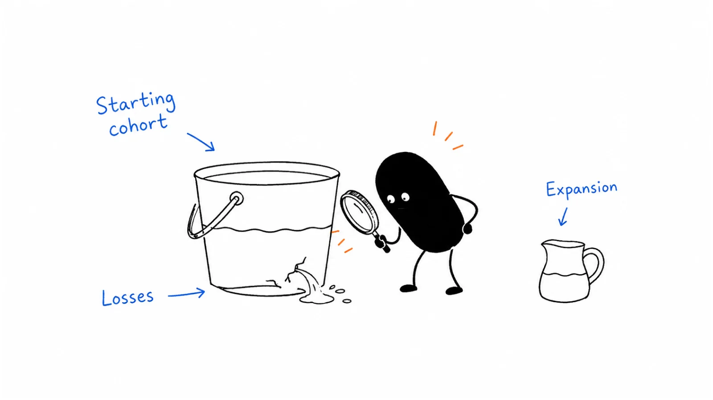

**Last reviewed:** 2026-08-30 · **Reading edit:** 2026-09-06

Revenue can grow while existing customers are quietly leaving or spending less. Separate lost revenue, downgrades, and expansion so you can see what is happening. Use gross and net retention together, with the same starting customer group and period.

*Reading guide: lost revenue + downgrades · the same starting cohort · expansion shown separately.*

## Use this when

- Leadership quotes NRR and nobody can say what left.
- Expansion is celebrating while logos quietly cancel.
- The board asks “what is a good churn rate” and someone pastes a SaaS blog table.
- CS and Finance use the same word for different formulas.

## Do not use this when

- There are no customers. Stay in [first ten](../01-strategy-and-buyers/first-ten-customers.md).
- You need the weekly CS operating system. That is [customer success](https://b2-b-playbook.mintlify.app/playbooks/08-lifecycle-and-customer-marketing/customer-success).
- You need the year-capacity model. That is [GTM planning](../09-operations-pipeline-and-measurement/gtm-planning.md).
- Legal revenue recognition is the request. Qualified owners.

## A few useful terms

| Word | Meaning here |
|---|---|
| **Customer / logo churn** | How many *customers* left. |
| **Gross revenue churn** | Recurring revenue lost to cancel + contraction, over starting recurring revenue. Expansion does **not** help this number. It cannot go negative. |
| **Net revenue churn** | (Cancel + contraction − expansion − reactivation) / starting recurring. **Can** go negative if the book that stayed grew more than the book that left. |
| **Negative net churn** | Expansion + reactivation > cancel + contraction. A property of the remaining book—not a reason to ignore who left. |

Write MRR or ARR and stick to it. Do not mix monthly medians with annual speeches.

## Keep this in mind

**Always show gross next to net.** Net can look like health while the product is leaking. Gross is the leak. Net is whether the remaining customers paid for that leak. Negative net is an **expansion loop**, not a slogan you put on a hiring deck.

## How to do it

### Step 1: Define the revenue movements

For the period: new business, expansion, contraction, churn (cancel), reactivation. Same starting balance. Same currency. If a movement cannot be tied to a customer, it does not belong in the speech.

### Step 2: Calculate gross and net measures

Gross = (churn + contraction) / start.  
Net = (churn + contraction − expansion − reactivation) / start.

If you only report net, you are choosing the coat of paint. If you only report logos, a whale downgrade is invisible.

### Step 3: Compare rates in the right context

Median-by-ARR-band tables on a metrics vendor’s site are **their** sample, **their** month, **their** mix of PLG and sales-led. Early-stage companies churn more; higher ARPA often churns less. That is a shape, not your target. Write *your* start-of-period book, *your* term, *your* segment. Then compare to last period—not to a chart that says 40% of &#36;15–30M companies have negative churn.

### Step 4: Assign an owner to each problem

Gross up → product, onboarding, packaging, or ICP. See [customer onboarding](https://b2-b-playbook.mintlify.app/playbooks/08-lifecycle-and-customer-marketing/customer-onboarding) and [customer success](https://b2-b-playbook.mintlify.app/playbooks/08-lifecycle-and-customer-marketing/customer-success). Net rescued only by expansion → you are growing the survivors; you have not fixed who leaves. Put that sentence in [GTM planning](../09-operations-pipeline-and-measurement/gtm-planning.md) so new-logo quota is not a cover story.

## Worked example (illustrative)

Sales-assist ops tool. Start MRR &#36;100. Not a benchmark.

| Movement | Amount |
|---|---|
| Start | 100 |
| Churn | 10 |
| Contraction | 10 |
| Expansion | 10 |
| Reactivation | 0 |
| Gross | 20% |
| Net | 10% |

We will not tell the board “churn is 10%” without the 20%.

## Copy: retention math (fill)

- Period and unit (MRR / ARR):
- Starting recurring:
- Churn · contraction · expansion · reactivation:
- Gross rate:
- Net rate:
- What we will **not** call “good” from a public table:
- Job that owns the gross leak:
- How this number shows up in the GTM plan:

Working file: [revenue-churn.md](../../templates/revenue-churn.md).

## Before you start

- [ ] CS and Finance use the same five movements.
- [ ] Gross and net are both on the slide.
- [ ] Logo churn is shown when the story is logos.
- [ ] No pasted ARR-band “median” as the OKR.
- [ ] Expansion is not used to hide a cancel spike.
- [ ] New-logo plan names the leak it must cover.

## Metrics

| Metric | Diagnostic use |
|---|---|
| Gross vs net gap | Expansion makeup vs real leak |
| Logo vs revenue churn | Whale vs crowd |
| Expansion that does not touch at-risk | Growth theater |
| Re-forecast after a cancel cohort | Whether the plan heard the leak |

Do not count resemblance to a SaaS glossary, or a vendor’s top-decile cell, as retention.

## Common mistakes

- Reporting only net.
- Calling negative net “we don’t need new customers.”
- Mixing customer churn with revenue churn in one sentence.
- Pasting ChartMogul (or any) cohort tables into the board pack as *our* target.
- Celebrating NRR while onboarding still produces cancel.

## What to read next

Who runs the book is [customer success](https://b2-b-playbook.mintlify.app/playbooks/08-lifecycle-and-customer-marketing/customer-success). First value is [customer onboarding](https://b2-b-playbook.mintlify.app/playbooks/08-lifecycle-and-customer-marketing/customer-onboarding). Additional value that must not hide this leak is [expansion marketing](https://b2-b-playbook.mintlify.app/playbooks/08-lifecycle-and-customer-marketing/expansion-marketing). The clock before the commercial path is [renewal marketing](https://b2-b-playbook.mintlify.app/playbooks/08-lifecycle-and-customer-marketing/renewal-marketing). Whether next year can close is [GTM planning](../09-operations-pipeline-and-measurement/gtm-planning.md). Pay still cares when the dollar is safe: [incentive timing](../09-operations-pipeline-and-measurement/incentive-timing.md).

## Sources and evidence boundary

This is an owner-maintained operating synthesis. It is not subscription-analytics software and not a SaaS benchmark service.

Gross vs net revenue churn, the five MRR movements, the warning that net can hide the leak, and negative net as an expansion property are distilled from a public metrics explainer ([ChartMogul, *Revenue churn*](https://chartmogul.com/saas-metrics/revenue-churn/?ref=b2b-playbook)). That page is a **method prompt**, not a source to copy. Its ARR-band and ARPA tables, “40% of &#36;15–30M have negative churn,” median early-stage rates, and product UI are **not** this library’s targets. Named quotes on that page stay with their speakers.

---

Copyright © 2026 Ivan Xu. All rights reserved. See the [copyright and reuse terms](https://github.com/weilun88313/B2B-Playbook/blob/main/LICENSE).

Canonical source: [github.com/weilun88313/B2B-Playbook](https://github.com/weilun88313/B2B-Playbook)
