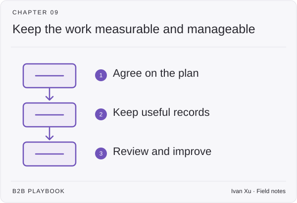

# 09 · Operations, pipeline & measurement

This chapter covers the practical systems behind marketing and revenue work: plans, budgets, CRM records, measurement, team routines, and AI workflows. Choose the part you need; you do not have to build all of it at once.

**Status:** Domain guide published · 18 tactic playbooks published

**Last reviewed:** 2026-09-06

## Start here

- [GTM planning](gtm-planning.md) — demand from channels.
- [Measurement model](measurement-model.md) — what tracking records.
- [AI workflow](ai-workflow.md) — ground the inputs.

## Playbook map

| Guide | What it helps you do |
|---|---|
| [Sales compensation](sales-compensation.md) | How should quota-carrying people be paid, credited, told the plan, and paid on time? |
| [Forecasting](forecasting.md) | How should hygiene, stages, categories, and calls make a number leadership can defend? |
| [Lead scoring](lead-scoring.md) | When does person-level fit and behavior justify a different action? |
| [GTM planning](gtm-planning.md) | Can demand creation and sales capacity produce the same number—after strategy inputs are ranked? |
| [Budget and planning](budget-and-planning.md) | How should resources, monthly headcount, and efficiency diagnostics iterate with that plan? |
| [Marketing org](marketing-org.md) | Who do we hire so fuel, engine, and PMM are covered—without too many firsts? |
| [Sales-leadership ramp](sales-leadership-ramp.md) | What should a new sales leader actually do in 90 days? |
| [CRM data model](crm-data-model.md) | Which objects and fields are the commercial record, and what will we refuse to migrate? |
| [MarTech governance](martech-governance.md) | Which job may a tool do, and when do we remove it? |
| [Sales operating cadence](sales-operating-cadence.md) | How should weekly meetings split pipeline, forecast, and coaching? |
| [Company cadence](company-cadence.md) | How do the sales–finance and product–marketing calendars snap together? |
| [Incentive timing](incentive-timing.md) | When is commission safe, and how do we reverse or advance it without improvising? |
| [RevOps compensation](revops-compensation.md) | How should RevOps be paid without a second sales quota? |
| [Experimentation](experimentation.md) | Which test can produce a credible learning or causal estimate? |
| [GTM AI maturity](gtm-ai-maturity.md) | Where does each motion sit on the AI ladder, and which rung do we climb next? |
| [AI use-case selection](ai-use-case-selection.md) | Which company problem deserves an AI bet this quarter—not which tool? |
| [AI workflow](ai-workflow.md) | What artifact, gate, and collapse must exist before we build? |
| [Measurement model](measurement-model.md) | Which decisions should each metric support—and what requires a human or a test? |

## Coming later

These topics are on the writing list. There is no article to open yet.

| Planned topic | Question to cover |
|---|---|
| Funnel model | How should audience and buyer progression be represented before pipeline? |
| Pipeline model | How should marketing contribution connect to qualified revenue progression? |
| Lifecycle stages | Which shared states and transition rules should systems enforce? |
| Account scoring | How should account fit, engagement, relationships, and timing be combined? |
| Routing and SLA | Who should act on each signal, by when, and with what context? |
| Attribution | Deeper model math. Two scoreboards and HDYHAU already live in [measurement model](measurement-model.md). |
| Dashboards | Which views help an operator make a recurring decision? |
| Privacy and compliance operations | How should consent, lawful use, retention, access, and deletion be operationalized? |

## Where to go next

Pick a guide above for the task you are working on, or browse [Strategy & buyers](../01-strategy-and-buyers/) for a related part of the work.

[Back to the playbook index](../README.md)

---

Copyright © 2026 Ivan Xu. All rights reserved. See the [copyright and reuse terms](../../LICENSE).

Canonical source: [github.com/weilun88313/B2B-Playbook](https://github.com/weilun88313/B2B-Playbook)
