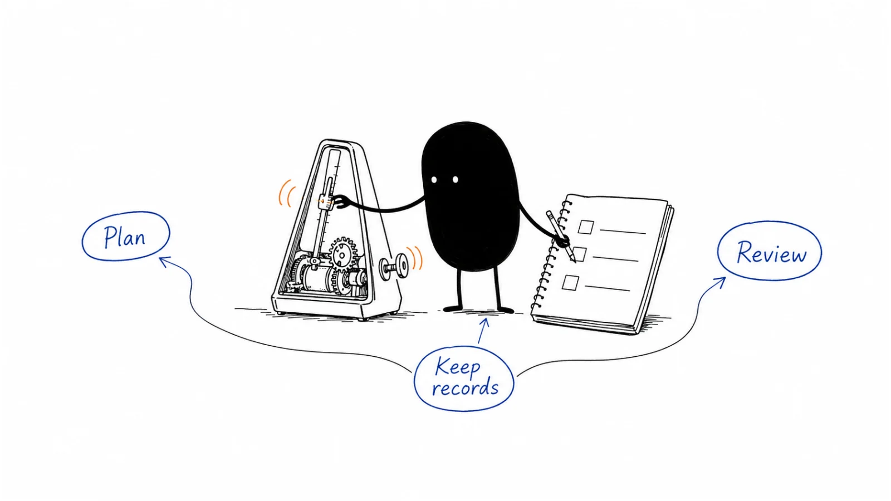

# 09 · Operations, pipeline & measurement

When the numbers disagree or a request falls between teams, more software may not be the first answer. Begin with the decision, the records behind it, and the person responsible. Use these guides to make planning, measurement, and everyday team routines easier to run.

**Last reviewed:** 2026-09-06 · **Reading edit:** 2026-09-12

## Start here

1. [Understand what the numbers can tell you](measurement-model.md) — Compare recorded activity with what buyers say.
2. [Make sure each request has an owner](routing-and-sla.md) — Agree who responds, by when, and what happens when a rule fails.
3. [Build a plan the team can deliver](gtm-planning.md) — Compare expected demand with time, money, and capacity.

## Playbook map

| Guide | What it helps you do |
|---|---|
| [Sales compensation](sales-compensation.md) | What work should the pay plan reward, and how will it be calculated? |
| [Forecasting](forecasting.md) | Which deals are likely to close, when, and on what evidence? |
| [Lead scoring](lead-scoring.md) | Which next action should a contact’s fit and activity help us choose? |
| [GTM planning](gtm-planning.md) | Can our demand, team capacity, and budget support the plan? |
| [Budget and planning](budget-and-planning.md) | What will the planned work cost each month? |
| [Marketing org](marketing-org.md) | Which marketing responsibilities and hires does the company need now? |
| [Sales-leadership ramp](sales-leadership-ramp.md) | What should a new sales leader learn before making changes? |
| [CRM data model](crm-data-model.md) | What should each record mean, and how should the records connect? |
| [MarTech governance](martech-governance.md) | Which tool fits the job, and what will it take to use it well? |
| [Sales operating cadence](sales-operating-cadence.md) | Which meetings help the team forecast, create opportunities, and improve? |
| [Company cadence](company-cadence.md) | How do we coordinate launches, campaigns, and sales deadlines? |
| [Incentive timing](incentive-timing.md) | When is commission earned and paid, and how are exceptions handled? |
| [RevOps compensation](revops-compensation.md) | How should an operations role be rewarded for work it can influence? |
| [Experimentation](experimentation.md) | What test would help us make the next decision? |
| [GTM AI maturity](gtm-ai-maturity.md) | How reliably can AI help with this particular team workflow? |
| [AI use-case selection](ai-use-case-selection.md) | Which task is worth improving with AI, and what simpler options exist? |
| [AI workflow](ai-workflow.md) | How do we make an AI-assisted process useful and checkable? |
| [Measurement model](measurement-model.md) | What do tracking, buyer conversations, and experiments each tell us? |
| [Funnel model](funnel-model.md) | How does the same group of people or accounts progress over time? |
| [Pipeline model](pipeline-model.md) | How do open opportunities, new business, wins, and losses fit together? |
| [Lifecycle stages](lifecycle-stages.md) | What must happen before a person or account moves to the next state? |
| [Account scoring](account-scoring.md) | Which accounts deserve attention, and can we explain why? |
| [Routing and SLA](routing-and-sla.md) | Who should handle each request, by when, and with what fallback? |
| [Attribution](attribution.md) | How does the reporting rule assign credit, and what can it miss? |
| [Dashboards](dashboards.md) | Which view would help someone make a recurring decision? |
| [Privacy and compliance operations](privacy-and-compliance-operations.md) | How do approved data uses and contact preferences hold across our systems? |

## Try one thing

Pick one recurring report or meeting. Write the decision it is meant to support, the information needed, and the person who can act on it.

## Where to go next

Pick a guide above for the task you are working on, or browse [Strategy & buyers](../01-strategy-and-buyers/) for a related part of the work.

[Back to the playbook index](../README.md)

**Status:** Domain guide published · 26 tactic playbooks published

---

Copyright © 2026 Ivan Xu. All rights reserved. See the [copyright and reuse terms](../../LICENSE).

Canonical source: [github.com/weilun88313/B2B-Playbook](https://github.com/weilun88313/B2B-Playbook)
