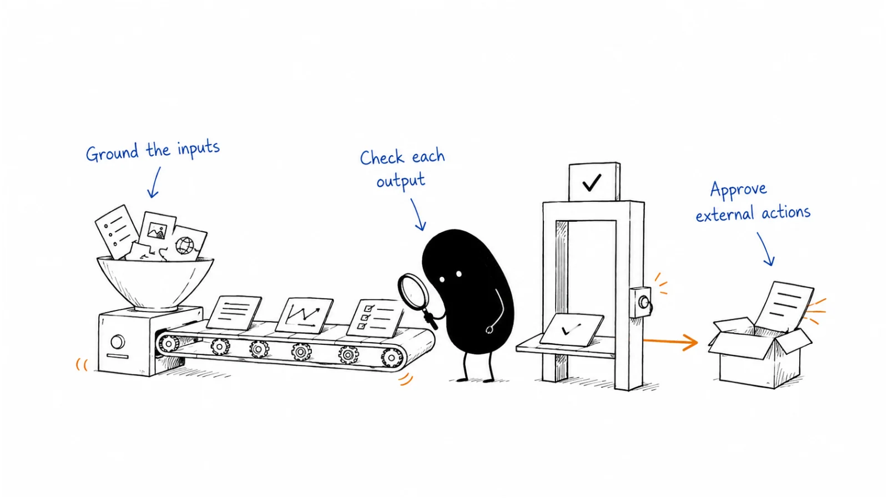

**Last reviewed:** 2026-08-30 · **Reading edit:** 2026-09-06

An AI workflow needs clear inputs, a useful output, and a way to catch mistakes. Break the work into steps people can inspect, record sources where facts matter, and require approval before customer-facing actions. Start with a real task you already understand.

*Reading guide: ground the inputs → check each output → approve external actions.*

## Use this when

- You are designing a repeatable agent, orchestrator, or internal AI path (pre-call brief, inbound draft, content derivatives).
- Last quarter’s “workflow” was a vibe prompt that looked right and skipped the work.
- You want an outbound agent and have not written what it may do when it is unsure.

## Do not use this when

- The problem is still a shopping list. Return to [AI use-case selection](https://b2-b-playbook.mintlify.app/playbooks/09-operations-pipeline-and-measurement/ai-use-case-selection).
- You only need a one-off chat. Do not industrialize it.
- You need the company to show up in answers. That is [SEO and AEO](../04-channels-and-distribution/seo-and-aeo.md) and [content strategy](../03-brand-story-and-content/content-strategy.md).
- Legal, privacy, or employment review is the request. Qualified owners; this is not that advice.

## A few useful terms

| Word | Meaning here |
|---|---|
| **Artifact** | The thing that must exist before the next move is allowed. |
| **Gate** | The condition that advances a stage—conditional, not “and then we…”. |
| **Collapse** | What you do when the stage cannot honestly finish. |
| **Action space** | What the agent may do without a human. |
| **Escalation** | What forces a human—ambiguity, existing customer, legal language, send. |

## Keep this in mind

**Do not ask “what are the steps?” Ask: what artifact must exist before the next move is allowed?** If a stage has no artifact, no gate, and no collapse, it is ceremony. If an external message has no human approval, it is an incident waiting for a cron job.

## How to do it

### Step 1: Define the finished output

What does the workflow produce? Why is a good one good? What must not be lost when you reproduce it? One-off, personal repeatable, or a module other people will run—pick one. If the output is still “help with sales,” stop.

Write what the example (if you have one) actually depends on: process moves you will keep, tone you will keep, anti-patterns you will ban.

### Step 2: Set the human and AI responsibilities

Exact use case. Final deliverable. Human role. AI role. Success condition. **Unacceptable** failure. At least one hard constraint. Inputs you are guaranteed versus ones you will pretend to have. Tools and sources that are allowed. Assumptions that are forbidden.

Stop if another operator could not run this from the card.

### Step 3: Identify likely failure modes

Likely shortcuts. Fake-success (the brief looks complete and the ICP was guessed). Stage-mixing. Laundering a guess as evidence. The highest-cost wrong answer (email the wrong account; invent a security claim).

If you have not named the expensive failure, you are decorating.

### Step 4: Break the workflow into reviewable steps

For each stage: objective, allowed evidence, prohibited moves, required artifact, advancement gate, collapse condition, recovery move. Repeat until the final package. Then try to break it: can the model jump to the end, fake a stage, or look right without obeying the gates?

Kill stages that exist for elegance. If the job is lighter than the architecture, simplify.

### Step 5: Define approval rules for external actions

1. **Assignment** — what it is trying to finish.
2. **Permitted action space** — read, draft, classify—not send, not discount, not invent policy.
3. **Escalation** — existing customer, legal words, weak fit, missing inputs.
4. **Output format** — fields, not a vibe paragraph.

Human-in-the-loop on anything that leaves the company. The first ten live runs are a review, not a celebration. Candidate jobs that usually deserve this discipline: a pre-call brief, an inbound classification plus draft, a derivative-content pack—**one** of them, chosen because it is frequent, low-judgment, and has a defined output. That selection still sits on [AI use-case selection](https://b2-b-playbook.mintlify.app/playbooks/09-operations-pipeline-and-measurement/ai-use-case-selection).

Parseable owned facts (positioning, packaging, proof, FAQ) still belong on durable URLs. Markdown mirrors can help agents; they are not a substitute for [content strategy](../03-brand-story-and-content/content-strategy.md). Do not copy another firm’s `/resources/` tree or their sprint price list.

## Worked example (illustrative)

Sales-assist ops tool. Six discovery calls a week.

| Field | Fill |
|---|---|
| Artifact | One-page brief: company, ICP fit (high/med/low + why), two opening questions, risks. |
| Human / AI | AE reads and marks up; agent researches public pages against the ICP file. |
| Unacceptable | Invented stack; emailed the prospect; treated a current customer as a new logo. |
| Stages | (1) Load ICP + CRM note. Gate: both present or collapse to “manual.” (2) Public research. Artifact: sourced bullets. (3) Fit call. Gate: evidence tagged. (4) Questions + risks. |
| Action space | Read public web + CRM. Draft only. |
| Escalation | Existing opp, privacy flag, fit = low with no evidence. |
| Attack | Model skipped sources and filled “likely uses Salesforce.” Fix: empty source → collapse. |

## Copy: workflow card (fill)

- Final artifact and why a good one is good:
- Human role / AI role:
- Success / unacceptable failure:
- Hard constraint:
- Guaranteed inputs / forbidden assumptions:
- Stages (artifact · gate · collapse · recovery):
- How we tried to break it:
- Assignment · action space · escalation · output format:
- Human gate before send (yes/no):

Working file: [ai-workflow.md](../../templates/ai-workflow.md). The teammate instructions come after: [ai-teammate-brief.md](../../templates/ai-teammate-brief.md).

## Before you start

- [ ] The artifact is concrete enough to reject a bad draft.
- [ ] Every stage has an artifact, a gate, and a collapse.
- [ ] The expensive failure is written.
- [ ] External send requires a human.
- [ ] Action space does not include “be helpful.”
- [ ] We did not paste a public worksheet as the live SOP.
- [ ] We did not deploy because a cookbook said it was week 60.

## Metrics

| Metric | Diagnostic use |
|---|---|
| First ten runs reviewed | Whether the gates are real |
| Collapses used vs silent guesses | Honesty |
| Sends without approval | Incident |
| Stages removed after the attack | Ceremony vs risk |

Do not count workflows drawn, or resemblance to a paid architect worksheet, as reliability.

## Common mistakes

- Vibes prompt → production.
- Stages with no artifact.
- Automating judgment.
- A second browser for the team to live in.
- Agent commerce / protocol theater before one HITL workflow works.
- Copying a fractional-consultant 90-day price ladder as your plan.
- Building the workflow before [AI use-case selection](https://b2-b-playbook.mintlify.app/playbooks/09-operations-pipeline-and-measurement/ai-use-case-selection) names the problem.

## What to read next

The bet this workflow serves is [AI use-case selection](https://b2-b-playbook.mintlify.app/playbooks/09-operations-pipeline-and-measurement/ai-use-case-selection). The ladder the company is on is [GTM AI maturity](https://b2-b-playbook.mintlify.app/playbooks/09-operations-pipeline-and-measurement/gtm-ai-maturity). The test row is [experimentation](https://b2-b-playbook.mintlify.app/playbooks/09-operations-pipeline-and-measurement/experimentation). The record it may write is [CRM data model](https://b2-b-playbook.mintlify.app/playbooks/09-operations-pipeline-and-measurement/crm-data-model). Findability of the facts it reads is [SEO and AEO](../04-channels-and-distribution/seo-and-aeo.md). Then write the teammate: [ai-teammate-brief.md](../../templates/ai-teammate-brief.md).

## Sources and evidence boundary

This is an owner-maintained operating synthesis. It is not a Sacred Loop product, not a Sun Business Group engagement, and not an Agent Commerce Protocol implementation.

Artifact-first stages (gates, collapse, recovery, attack-the-design) are distilled from a public operator worksheet ([Jason Hubbard / Sacred Loop, *AI Workflow Architect Worksheet*](https://substack.sacredloop.ai/p/ai-workflow-architect-worksheet?ref=b2b-playbook)). Assignment, permitted action space, escalation, and output format before outbound agents—and the reminder that agents parse structured meaning—are distilled from a public GTM prep note ([Sun Business Group, *Agentic Prep Cookbook*](https://www.sunbusinessgroup.com/resources/agentic-prep-cookbook.md?ref=b2b-playbook), linked from their [resources directory](https://www.sunbusinessgroup.com/resources/DIRECTORY.md?ref=b2b-playbook)). Both are **method prompts**, not sources to copy. Gated manuals, `/resources/` file recipes, ACP checklists, sprint prices, course pitches, and phone numbers are **not** this library’s program.

---

Copyright © 2026 Ivan Xu. All rights reserved. See the [copyright and reuse terms](https://github.com/weilun88313/B2B-Playbook/blob/main/LICENSE).

Canonical source: [github.com/weilun88313/B2B-Playbook](https://github.com/weilun88313/B2B-Playbook)
