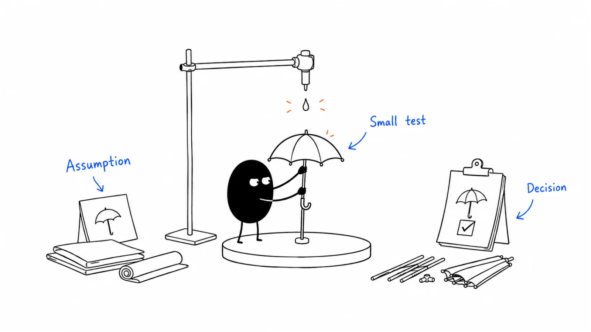

**Last reviewed:** 2026-08-30 · **Reading edit:** 2026-09-12

A useful experiment helps you decide what to do next. Write down the assumption, the smallest reasonable test, and how you will interpret the result before you start. Record what happened so the next person does not have to repeat the same guess.

*Reading guide: state an assumption → run a small test → decide and record what changed.*

## Use this when

- Next year’s plan is a stack of untested ICP, message, and channel bets.
- Campaigns launch at full budget because “we aligned in Q4.”
- Sales, marketing, and product each have a different story about what worked last quarter, and none of it is written down.
- Leadership wants more tests, and the calendar is already a pile of one-off ads with no decision attached.

## Do not use this when

- There is no ICP and no primary motion. Stay in [ICP](../01-strategy-and-buyers/icp.md) and [channel strategy](../04-channels-and-distribution/channel-strategy.md).
- You need a page a champion can forward. Write [content strategy](../03-brand-story-and-content/content-strategy.md) first; then test distribution.
- Legal or privacy forbids the treatment. This page will not bless dark patterns or unconsented lists.
- The request is “prove marketing with a multi-touch model.” That is a different job.

## A few useful terms

| Word | Meaning here |
|---|---|
| **Hypothesis** | One testable belief: *if we do X for Y, we will see Z, which would mean we should D* |
| **Decision** | What you will change if the test holds, and what you will stop if it fails |
| **Signal** | Enough evidence to choose—not a perfect p-value |
| **Learning log** | Dated record of hypothesis, result, and the GTM object it updates (ICP, message, channel, scoring) |

## Keep this in mind

**One assumption per test, and a decision the result is allowed to change.** “We think this might work” is not a hypothesis. A test that cannot alter the plan is a campaign with extra slides. Do not A/B-test a strategy question (which ICP, which motion) as if it were a headline.

## How to do it

### Step 1: Write an assumption you can test

Pull the hidden bets out of the annual plan: who the buyer is, which pain they will move for, which words they use, which channel they will answer. Isolate **one**.

Shapes that work:

- *Segment:* [role] in [industry] will [book / click / reply] more on [this offer] than [that adjacent role].
- *Message:* language about [problem A] will beat [problem B] on [metric] in [this list].
- *Channel:* [channel] will beat [channel] for [this segment] on [conversion to a sales-usable next step]—not on vanity reach.

If you cannot name what would prove you wrong, you are still brainstorming.

### Step 2: Design a small, useful test

Answer, on one card:

1. **Decision** this informs (ICP list, campaign narrative, spend, enablement).
2. **Success metric** that a seller would recognize (meeting, qualified conversation)—not “engagement” unless that is the actual decision.
3. **Who** you are testing (a named slice, not “the market”).
4. **How small** you can go and still believe the comparison (two variants, one audience, a clock).
5. **When** you will stop (a date, not “until it works”).

A two-week paid or email pair with a meeting KPI beats a six-month “brand study” that cannot change Q2. You do not need a lab. You need a treatment, a control or a contrast, and a log.

A useful operating tempo—not a law: a few hypothesis-driven tests per quarter, each tied to a GTM object, beats a dashboard of leftover A/B tests nobody reads.

### Step 3: Record the result and its meaning

Collect the number **and** what sales heard. A higher CTR that produces worse meetings is a failed hypothesis if the decision was “which message we put in the pitch.”

When it ends, write four lines: what we tested, what happened, what we now believe, **which artifact changes** (ICP tier, messaging hierarchy, channel mix, [lead scoring](https://b2-b-playbook.mintlify.app/playbooks/09-operations-pipeline-and-measurement/lead-scoring) inputs). Tag the learning: segment / message / channel / motion. Do not let the result live in a Slack screenshot.

### Step 4: Expand only after reviewing the evidence

Scaling is not “do more of everything.” Promote a winning message into the core narrative. Promote a winning slice into tier criteria. Move spend toward a channel that produced the **sales-usable** step cheaper. Feed a behavioral signal into scoring only if you will inspect it—see [lead scoring](https://b2-b-playbook.mintlify.app/playbooks/09-operations-pipeline-and-measurement/lead-scoring).

A failed test that kills a bad ICP story is a win. Celebrate learning velocity in the review, not only the variant that “won.”

### Step 5: Keep a shared experiment log

Marketing, sales, and product put hypotheses in the same ledger. Airtable vs Notion vs a Sheet is a tooling choice; the requirement is **one** list of in-flight and closed tests. If [MarTech governance](https://b2-b-playbook.mintlify.app/playbooks/09-operations-pipeline-and-measurement/martech-governance) later buys a testing SKU, it still writes into this log.

Hold a **weekly experiment review** that only asks: what closed, what did we believe, which artifact changed. That is how a growth mindset shows up. A slide of “tests launched” is not the review.

Name each bet as **engine** (a loop that can compound), **lubricant** (makes the engine cheaper), or **turbo** (a one-off). A calendar of only turbos is a launch habit, not a system. [Channel strategy](../04-channels-and-distribution/channel-strategy.md) still names the primary motion; this page refuses to optimize a motion you have not chosen.

## Worked example (illustrative)

Sales-assist cybersecurity. Not your vertical.

| Field | Fill |
|---|---|
| Hypothesis | Compliance directors book a scoped call more often on “audit-ready evidence pack” than on “risk visibility platform” in a two-week LinkedIn pair, same ICP list. |
| Decision | If true, the Q2 campaign and the first-meeting insight use audit language; if false, we stop the audit creative. |
| Metric | Meetings booked / 1,000 impressions, plus AE note: did the call match the ad? |
| Scope | Two ads, one audience, 14 days, cap we can afford to lose. |
| Learning | Audit copy +1.8× meetings; AEs said the call started on evidence, not a platform tour. Promoted to campaign narrative. Scoring: no change yet. |

## Copy: experiment card (fill)

- Assumption we are willing to be wrong about:
- If true we will ______; if false we will stop ______:
- Audience slice:
- Treatment vs contrast:
- Sales-usable success metric:
- Start / stop dates:
- Owner:
- Result (number + what sales heard):
- Artifact we updated (ICP / message / channel / scoring / none):
- Tag (segment / message / channel / motion):

Working file: [gtm-experiment-ledger.xlsx](../../templates/gtm-experiment-ledger.xlsx).

## Before you start

- [ ] The hypothesis names one assumption and a falsifier.
- [ ] A GTM decision is written before launch.
- [ ] The metric is a next step sales would use, or an explicit diagnostic.
- [ ] Scope and stop date exist.
- [ ] The log is shared; this test has a row before it spends.
- [ ] We will not scale “everything that moved a vanity chart.”
- [ ] Privacy and list source are allowed for this treatment.

## Metrics

| Metric | Diagnostic use |
|---|---|
| Tests closed with a written decision | Whether the loop exists |
| Assumptions killed vs campaigns scaled | Whether the tests changed a decision |
| Time from idea to stop date | Speed |
| Re-run of the same guess next quarter | Log failure |

Do not count experiments launched, or a decorated “innovation” slide, as a testing system.

## Common mistakes

- Vague hunches dressed as hypotheses.
- Tests that cannot change the plan.
- Six-month campaigns called experiments.
- Optimizing CTR while the meeting quality collapses.
- Scaling volume because one cell was green.
- No shared log, so Q3 repeats Q1.
- Copying another consultancy’s “2–3 tests per quarter” or vertical examples as your calendar.
- Using an LLM citation score as the success metric for a message test—see [SEO and AEO](../04-channels-and-distribution/seo-and-aeo.md) for that job.

## What to read next

Whether the year can even close is [GTM planning](https://b2-b-playbook.mintlify.app/playbooks/09-operations-pipeline-and-measurement/gtm-planning). Which AI problem deserves a bet before you open a test row is [AI use-case selection](https://b2-b-playbook.mintlify.app/playbooks/09-operations-pipeline-and-measurement/ai-use-case-selection). Which pages exist before you test distribution is [content strategy](../03-brand-story-and-content/content-strategy.md). Which motion is primary is [channel strategy](../04-channels-and-distribution/channel-strategy.md). How buyers find you in search and answers is [SEO and AEO](../04-channels-and-distribution/seo-and-aeo.md). Routing a validated signal is [lead scoring](https://b2-b-playbook.mintlify.app/playbooks/09-operations-pipeline-and-measurement/lead-scoring).

## Sources and evidence boundary

This is an owner-maintained operating synthesis. It is not a causal-inference textbook and not a promise that small tests replace a strategy.

Hypothesis → small informative test → classify the learning → feed ICP, message, channel, and scoring is distilled from a public GTM testing essay ([Heinz Marketing, Win Dean-Salyards, undated 2026 planning post](https://www.heinzmarketing.com/blog/planning-your-gtm-testing-strategy-for-2026-from-hypothesis-to-scalable-growth/?ref=b2b-playbook)). That essay is a **method prompt**, not a source to copy. Vertical examples, suggested quarterly test counts, and vendor scoring tools named there are not this library’s calendar or a requirement to buy a platform.

The weekly review as the growth-mindset ritual, the warning not to A/B-test strategy questions, and the engine / lubricant / turbo split (Racecar) draw on Elena Verna’s framework essays ([9 favorite growth frameworks, 2024-10-25](https://www.elenaverna.com/p/my-9-favorite-growth-frameworks?ref=b2b-playbook); [weekly experiment review (subscription may be required)](https://www.elenaverna.com/p/improve-growth-mindset-in-your-company?ref=b2b-playbook)). Racecar as originally written by Lenny Rachitsky and Dan Hockenmaier stays with those authors. None of those pieces are a command to hire a growth squad or to copy Dropbox’s loop.

---

Copyright © 2026 Ivan Xu. All rights reserved. See the [copyright and reuse terms](https://github.com/weilun88313/B2B-Playbook/blob/main/LICENSE).

Canonical source: [github.com/weilun88313/B2B-Playbook](https://github.com/weilun88313/B2B-Playbook)
