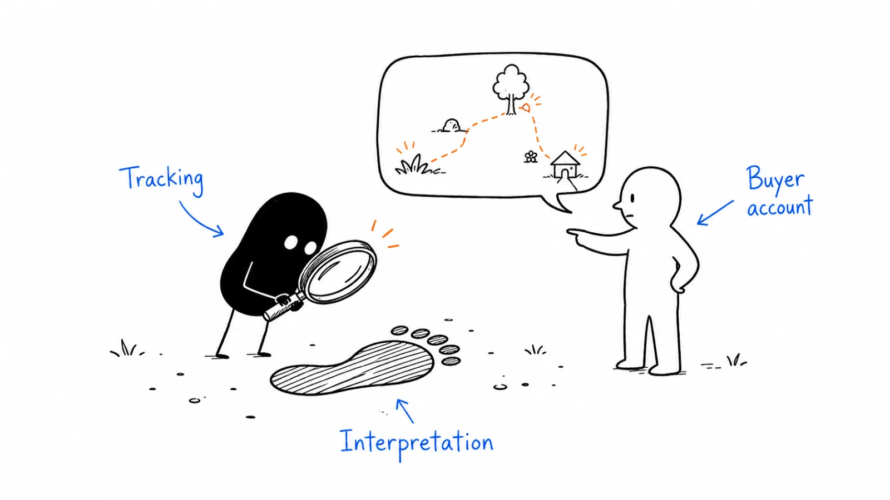

**Last reviewed:** 2026-08-30 · **Reading edit:** 2026-09-12

Analytics can show a recorded click path, while buyers may tell you a different story about how they found you. Keep both views. Use tracking for what it can observe, ask buyers directly, and use experiments for questions that attribution cannot settle.

*Reading guide: what tracking records · read the differences · what buyers tell you.*

## Use this when

- Last-click ROAS is how brand, podcast, and founder posts get defunded.
- Marketing and sales each have a “source” field and they disagree on every deal.
- Leadership wants “full-funnel attribution” before anyone asked buyers how they heard.
- Capture campaigns look like heroes and creation looks like waste.

## Do not use this when

- Lifecycle words are undefined. You will measure noise. Define [shared lifecycle stages](https://b2-b-playbook.mintlify.app/playbooks/09-operations-pipeline-and-measurement/lifecycle-stages) first or at least the [lead-scoring](https://b2-b-playbook.mintlify.app/playbooks/09-operations-pipeline-and-measurement/lead-scoring) actions.
- You need a test design. That is [experimentation](https://b2-b-playbook.mintlify.app/playbooks/09-operations-pipeline-and-measurement/experimentation).
- You need next year’s capacity math. That is [GTM planning](https://b2-b-playbook.mintlify.app/playbooks/09-operations-pipeline-and-measurement/gtm-planning).
- The request is to implement a vendor’s multi-touch model as the source of truth.

## A few useful terms

| Word | Meaning here |
|---|---|
| **Creation scoreboard** | Memory and future cash flow: reach, evenness, HDYHAU, sales mentions—on a long clock |
| **Capture scoreboard** | In-market response: qualified conversations, sales-accepted pipeline, close—on a short clock |
| **Software attribution** | What cookies, UTMs, and CRM source fields can see |
| **Self-reported (SRA)** | What the buyer says, in their words, when asked |
| **Hybrid** | Read both. Do not average them into one fake ROAS |

## Keep this in mind

**Software measures capture paths; humans measure creation paths; neither alone is the budget.** If you only have UTMs, you will over-fund search and retargeting. If you only have stories, you will fund vibes. Ask on the high-intent form, keep the UTM, and refuse to pick a winner with one column.

## How to do it

### Step 1: Keep channel tracking and buyer feedback separate

Write which weekly review reads **capture** (qualified conversations, accept rate, capture CAC you actually believe) and which quarterly review reads **creation** (category reach/evenness if you pay for it, HDYHAU mix, branded search, sales “I have been seeing you”). The [CMO Scorecard](https://business.linkedin.com/advertise/resources/b2b-institute/cmo-scorecard?ref=b2b-playbook) is the public version of “creative and media inputs, long-horizon outcomes.” You do not need their product to refuse a 14-day CPL on a memory campaign.

Kellblog-style board metrics (pipeline coverage, CAC payback, NRR) stay **company** numbers. Do not let a channel dashboard impersonate them.

### Step 2: Ask buyers how they found you

On [demo request](../07-website-and-conversion/demo-request.md) and other hand-raises: mandatory **free text**, no dropdown, no “Google / LinkedIn / Event” hints. Categorize after—string-match or a human pass. Prompting the list biases the study.

Do not put HDYHAU on every content gate. You will train “idk” and you will think you measured demand.

### Step 3: Be clear about what software records

UTMs: first meaningful marketing touch **and** the session that converted—both stored, neither holy. Source = the offer or destination when that is more predictive than the referring hostname (a Refine Labs ops note, not a law). Sales may overwrite with a human source only through a written rule; silent edits are how two truths appear.

Last-touch and first-touch are **diagnostics**. They are not the budget.

### Step 4: Investigate differences between the two views

Hybrid means: *software says X, buyers say Y, here is what we will fund anyway.* Refine Labs’ public study (620 declared-intent conversions, twelve months, software vs SRA) reported a large gap on dark social—podcast was a majority of *their* self-reported revenue and ~0% of *their* software credit. That is **their** tape. Your mix will differ. The method is the mismatch review, not their 90%.

### Step 5: Use experiments for causal questions

“Does this channel work?” on a small, new buy is [experimentation](https://b2-b-playbook.mintlify.app/playbooks/09-operations-pipeline-and-measurement/experimentation): hypothesis, kill date, decision. Multi-touch models will not save a campaign that never defined the job. Incrementality tests and holdouts beat another attribution schema when the spend is large enough to justify them.

## Worked example (illustrative)

Sales-assist. Founder posts. Light search capture. No podcast yet.

| Field | Fill |
|---|---|
| Capture review | Weekly: sales-accepted from search + demo form. Owner: demand lead. |
| Creation review | Quarterly: HDYHAU categories + founder-mention rate in first meetings. Owner: founder + marketing. |
| SRA surface | Demo form only, open text |
| Software we keep | First UTM, last UTM, campaign on the converting session |
| We will not do | One ROAS to rank founder posts vs branded search |
| Mismatch we expect | Direct / unknown in CRM; “your LinkedIn” / “a colleague” in HDYHAU |

## Copy: measurement card (fill)

- Capture metrics, owner, cadence:
- Creation metrics, owner, cadence:
- HDYHAU: which forms, open text (yes/no), who categorizes:
- Software fields we will trust—and only for what:
- Board metrics we will not let a channel dashboard impersonate:
- Disagreement rule (what we fund when SRA and software fight):
- What we will test instead of attributing:

Working file: [measurement-model.md](../../templates/measurement-model.md).

## Before you start

- [ ] Two scoreboards are written; one weekly meeting does not mix them without a label.
- [ ] HDYHAU is open text on declared intent.
- [ ] UTM/source rules are written; sales edits are governed.
- [ ] Creation campaigns are excluded from 14-day CPL kill decisions.
- [ ] A mismatch review exists (even a spreadsheet).
- [ ] Privacy/consent owner knows what you store. This page is not that review.
- [ ] No vendor model is the single source of truth.

## Metrics

The model *is* a metric policy. Use this table as the refuse list:

| Allowed as a decision | Not allowed as the decision |
|---|---|
| Capture: qualified conversations, accept, win rate on captured demand | Platform ROAS on a creation campaign |
| Creation: HDYHAU mix, evenness, branded search, sales mentions | Last-click pipeline % as “marketing did this” |
| Hybrid mismatch notes | A blended “influenced” number nobody can audit |
| Experiment result with a kill date | Another attribution schema when the job was undefined |

## Common mistakes

- Buying HockeyStack / Dreamdata / a CDP to postpone asking buyers.
- Dropdown HDYHAU.
- One source field to rule them all.
- Firing the podcast because Salesforce said Organic.
- Treating Refine Labs’ 90% as your KPI.
- Asking attribution to answer a strategy question.

## What to read next

The form that collects SRA is [demo request](https://b2-b-playbook.mintlify.app/playbooks/07-website-and-conversion/demo-request). The buys that need two scoreboards are [paid media](https://b2-b-playbook.mintlify.app/playbooks/04-channels-and-distribution/paid-media) and [LinkedIn organic](https://b2-b-playbook.mintlify.app/playbooks/04-channels-and-distribution/linkedin-organic). Tests that can change the plan are [experimentation](https://b2-b-playbook.mintlify.app/playbooks/09-operations-pipeline-and-measurement/experimentation). Whether next year’s number is possible is [GTM planning](https://b2-b-playbook.mintlify.app/playbooks/09-operations-pipeline-and-measurement/gtm-planning). Person-level routing stays [lead scoring](https://b2-b-playbook.mintlify.app/playbooks/09-operations-pipeline-and-measurement/lead-scoring). Use [funnel model](https://b2-b-playbook.mintlify.app/playbooks/09-operations-pipeline-and-measurement/funnel-model) and [pipeline model](https://b2-b-playbook.mintlify.app/playbooks/09-operations-pipeline-and-measurement/pipeline-model) for progression, cohorts, and commercial planning.

## Sources and evidence boundary

This is an owner-maintained operating synthesis.

- **Two clocks: capture the 5, create among the 95; creative and media as inputs.** LinkedIn B2B Institute [95-5](https://www.linkedin.com/business/marketing/blog/research-and-insights/why-you-should-follow-the-95-5-rule?ref=b2b-playbook) and [CMO Scorecard](https://business.linkedin.com/advertise/resources/b2b-institute/cmo-scorecard?ref=b2b-playbook).
- **Open-text HDYHAU on declared-intent forms; software = capture, SRA = creation; read both.** Refine Labs [Attribution Mirage](https://www.refinelabs.com/blog/attribution-mirage?ref=b2b-playbook) and [Hybrid Attribution Framework](https://www.refinelabs.com/blog/hybrid-attribution-framework?ref=b2b-playbook). Sample sizes, &#36;21.5MM, and the 90% figure are **their** study. Method only.
- Board-level SaaS metrics: Kellblog as a **company** scoreboard voice—not as channel attribution.
- Multi-touch SaaS products are tools. They are not this method. [Attribution](https://b2-b-playbook.mintlify.app/playbooks/09-operations-pipeline-and-measurement/attribution) explains model math while retaining the distinction between tracked paths, buyer reports, and causal evidence.

---

Copyright © 2026 Ivan Xu. All rights reserved. See the [copyright and reuse terms](https://github.com/weilun88313/B2B-Playbook/blob/main/LICENSE).

Canonical source: [github.com/weilun88313/B2B-Playbook](https://github.com/weilun88313/B2B-Playbook)
