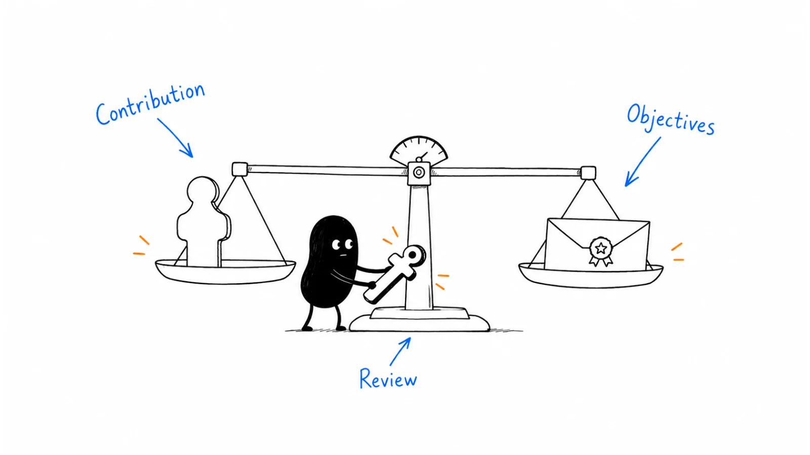

**Last reviewed:** 2026-08-29 · **Reading edit:** 2026-09-06

Revenue operations roles support many teams, so their incentives should reflect work they can influence. Choose a small number of measurable objectives, agree on how they will be assessed, and explain the payment schedule. Avoid copying a seller's commission plan without checking whether it fits.

*Reading guide: define the role's contribution → agree on measurable objectives → review and pay consistently.*

## Use this when

- The first RevOps hire is on a flat salary and a once-a-year “if we hit the number” bonus they cannot explain.
- Variable exists, but it is last year’s revenue or the CEO’s mood.
- You are copying the AE plan onto ops “so they have skin in the game.”
- Director-level ops is comparing notes with VP pay and you have no written scorecard.

## Do not use this when

- There is no RevOps job yet—only a founder and a spreadsheet. Stay in [CRM data model](https://b2-b-playbook.mintlify.app/playbooks/09-operations-pipeline-and-measurement/crm-data-model) and [forecasting](https://b2-b-playbook.mintlify.app/playbooks/09-operations-pipeline-and-measurement/forecasting).
- You need seller clawbacks and draws. That is [incentive timing](https://b2-b-playbook.mintlify.app/playbooks/09-operations-pipeline-and-measurement/incentive-timing).
- People/HR or a works council must set the band. This page will not.

## A few useful terms

| Word | Meaning here |
|---|---|
| **MBO** | A dated, observable objective the person can move (not “support the business”) |
| **Controllable** | An outcome their weekly work changes without requiring them to close deals |
| **Scorecard** | Two to four MBOs with weights, a 100% definition, and a payout date |
| **Discretion** | A bonus with no published rule. Treat it as a residual, not the plan |

## Keep this in mind

**Pay them for outcomes they can own.** Same neutrality as seller pay: if they do not control bookings, do not put most of variable on bookings. If the only lever is “Sales missed,” you trained them to argue with Sales instead of fixing the system. Skin in the game is a **scorecard**, not a second quota.

## How to do it

### Step 1: Define the role's contribution

*This person is paid to make ______ true every ______, measured as ______.*

Examples that work:

- Forecast call and CRM match within a defined variance by the weekly deadline.
- New AEs reach a defined hygiene and activity bar in *n* days (time-to-ramp you can audit).
- Required fields and stages stay at a published completeness; routing meets the SLA.
- Incentive calc from [sales compensation](https://b2-b-playbook.mintlify.app/playbooks/09-operations-pipeline-and-measurement/sales-compensation) / [incentive timing](https://b2-b-playbook.mintlify.app/playbooks/09-operations-pipeline-and-measurement/incentive-timing) pays on time with a dispute cap.

If you cannot finish the sentence, you are hiring a helper, not designing pay.

### Step 2: Choose a small set of measurable objectives

Useful families (pick what this year actually needs):

- **Predictability:** forecast accuracy / variance vs the published call—not a secret model.
- **Ramp:** time-to-first-full-quota-behavior for a defined role, with a denominator (hires in the window).
- **Adoption:** the team lives in the objects [MarTech governance](https://b2-b-playbook.mintlify.app/playbooks/09-operations-pipeline-and-measurement/martech-governance) allowed; shelfware does not count.
- **Hygiene / SLA:** stale commit, routing time, credit disputes closed in *n* days.
- **Enablement of the plan:** paydays correct; clawback windows visible. That is administration quality, not a SPIF.

Company revenue can be a **small** kicker with a floor (they are not bankrupted by a miss they could not book). It should not be the only line. Subjective “leadership discretion” as the main variable is how fairness dies: the person cannot inspect the rule.

### Step 3: Explain the payment schedule

Quarterly (or monthly, if the MBOs are that granular) beats an annual surprise. Publish the scorecard with the plan. Changing MBO weights in November because Q3 missed is the same malpractice as rewriting AE accelerators in July.

Document: weight, 100% definition, data source, who scores, payout date. If scoring is “we’ll know it when we see it,” it is discretion with extra steps.

### Step 4: Discuss cash and equity separately

Equity can signal long-term ownership. It does not replace a readable cash plan. If the grant is small or illiquid, say so in the offer conversation; do not use it to paper over a mushy bonus. Geography and company size move cash bands; that is a market fact to check, not a table to copy from a vendor PDF.

### Step 5: Explain and review the plan with the team

Managers (or the CRO) can explain the scorecard in one minute. The person acknowledges the written plan. Ops should be able to **see progress** the same way you wanted reps to see clawback risk: a dashboard, not a rumor.

## Worked example (illustrative)

First RevOps manager, sales-assist, eight AEs. Not a survey band.

| Field | Fill |
|---|---|
| Job sentence | Paid to keep the weekly call reconcilable to the CRM and to pay the AE plan on time. |
| Mix | 80% base / 20% variable (ops, not hunter). |
| MBO 1 (40% of variable) | Forecast variance vs manager call ≤ agreed band for 10 of 13 weeks. |
| MBO 2 (35%) | AE plan + clawback window visible in the CRM; payday within 10 business days of period close; disputes < 5% of payouts. |
| MBO 3 (25%) | Required opportunity fields complete on 95% of deals past stage 2. |
| Revenue kicker | None in year one. Company number is the AE plan, not this scorecard. |
| Clock | Quarterly. Weights frozen at the start of the quarter. |
| Discretion | 0% of variable. |

## Copy: RevOps scorecard (fill)

- Role and one-sentence job:
- Base / variable (and why this is not an AE mix):
- MBO 1 · weight · 100% definition · source:
- MBO 2 · weight · 100% definition · source:
- MBO 3 (optional) · weight · 100% definition · source:
- Company-revenue line (weight or none) and any floor:
- Payout cadence:
- Who scores, by when:
- Where progress is visible:
- Written plan + acknowledgment date:

## Before you start

- [ ] The job sentence does not require them to close.
- [ ] Two to four MBOs; each has a 100% definition and a source.
- [ ] Bookings quota is absent, or a small kicker with a written floor.
- [ ] Discretion is not the main variable.
- [ ] Cadence is published; mid-year weight changes need a named reason.
- [ ] They can see progress before payday.
- [ ] Seller clawbacks/draws are not this person’s *pay plan*; they may *administer* [incentive timing](https://b2-b-playbook.mintlify.app/playbooks/09-operations-pipeline-and-measurement/incentive-timing).
- [ ] Counsel / People has seen the document if required.

## Metrics

| Metric | Diagnostic use |
|---|---|
| Scorecard explainable in one minute | Same test as seller plans |
| Payout on the promised date | Administration |
| Attrition / offer-accept for the role | Band and clarity, not a poster |
| Mid-year MBO rewrites | Process failure |
| Share of variable on outcomes they do not own | Misalignment |

Do not count “we added variable,” or resemblance to an AE OTE, as a modern ops plan.

## Common mistakes

- A bookings quota on the people who cannot book.
- Annual bonus, unpublished rule, paid late.
- “Leadership discretion” as the product.
- Copying seller accelerators onto hygiene work.
- Changing the scorecard when Sales misses.
- Using equity talk to avoid writing MBOs.
- Pasting a vendor survey’s fairness percentages or geo bands as your offer.

## What to read next

Sellers still need [sales compensation](https://b2-b-playbook.mintlify.app/playbooks/09-operations-pipeline-and-measurement/sales-compensation) and [incentive timing](https://b2-b-playbook.mintlify.app/playbooks/09-operations-pipeline-and-measurement/incentive-timing). The system they run is [forecasting](https://b2-b-playbook.mintlify.app/playbooks/09-operations-pipeline-and-measurement/forecasting), [CRM data model](https://b2-b-playbook.mintlify.app/playbooks/09-operations-pipeline-and-measurement/crm-data-model), and [sales operating cadence](https://b2-b-playbook.mintlify.app/playbooks/09-operations-pipeline-and-measurement/sales-operating-cadence). Tools they may buy sit in [MarTech governance](https://b2-b-playbook.mintlify.app/playbooks/09-operations-pipeline-and-measurement/martech-governance).

## Sources and evidence boundary

This is an owner-maintained operating synthesis. It is not a compensation benchmark, not a hiring product, and not legal advice.

Paying ops for controllable, documented outcomes (MBOs, predictable cadence, less discretion, not a cloned sales quota) is distilled from a public survey-shaped report on RevOps leader pay ([QuotaPath / RevPal, RevOps compensation plans](https://www.quotapath.com/resource/revops-comp-plans-report/?ref=b2b-playbook)). That report is a **method prompt**, not a source to copy. Sample sizes, fairness percentages, salary-range spreads, equity sentiment, and vendor pitches in the report are **not** this library’s bands or a requirement to use their products. Geography and stage still require your own market check.

---

Copyright © 2026 Ivan Xu. All rights reserved. See the [copyright and reuse terms](https://github.com/weilun88313/B2B-Playbook/blob/main/LICENSE).

Canonical source: [github.com/weilun88313/B2B-Playbook](https://github.com/weilun88313/B2B-Playbook)
