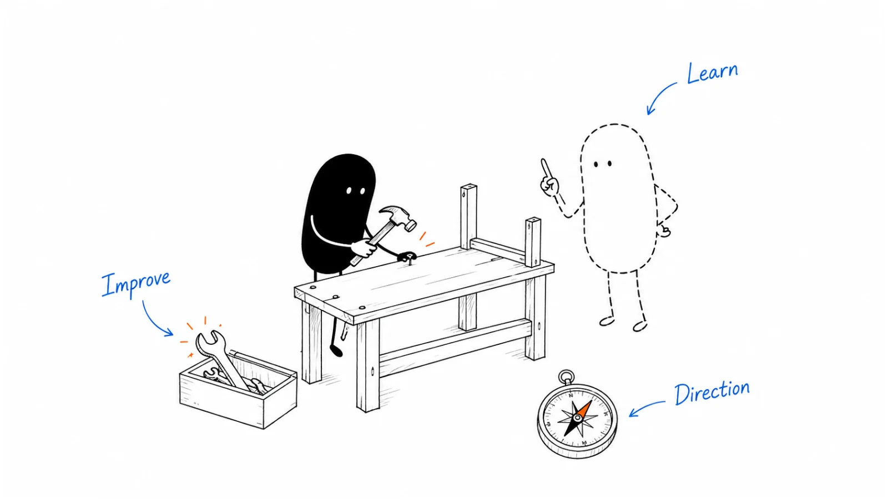

**Last reviewed:** 2026-08-29 · **Reading edit:** 2026-09-06

A new sales leader needs to understand customers, deals, and the team before making big changes. Use the first month to learn, the second to make a few useful improvements, and the third to agree on a plan grounded in what you have seen.

*Reading guide: days 1–30: learn → days 31–60: improve → days 61–90: set direction.*

## Use this when

- You hired (or became) the first sales leader who will run people, not only a book.
- The board wants a “plan” before anyone has sat in on a call.
- Pipeline, CRM, and goals cannot be explained by the people who live in them.
- Marketing and CS each think sales is the problem, and sales thinks the reverse.

## Do not use this when

- There are no customers and no motion. Stay in [first ten](../01-strategy-and-buyers/first-ten-customers.md) and [channel strategy](../04-channels-and-distribution/channel-strategy.md).
- You need a compensation plan. Write [sales compensation](https://b2-b-playbook.mintlify.app/playbooks/09-operations-pipeline-and-measurement/sales-compensation) as its own page; do not bury pay in a 90-day slide.
- You need a forecast design. That is [forecasting](https://b2-b-playbook.mintlify.app/playbooks/09-operations-pipeline-and-measurement/forecasting). This ramp *uses* those pages; it does not replace them.

## Keep this in mind

**Days 1–30 you are not the hero.** You are the auditor. Quick wins in days 31–60 come from what you actually saw—not from a generic org chart. Days 61–90 set a course **with** marketing and [customer success](../08-lifecycle-and-customer-marketing/customer-success.md), not a sales-only cave.

## How to do it

### Step 1: Days 1–30: observe and learn

Meet internal stakeholders. Sit with the people who sell. Take product training like a new AE. Watch live calls and demos. Begin an infrastructure audit (CRM, enablement, dialer, MAP—**what is actually used**). Audit the goals and metrics on the wall versus the metrics in the [forecast](https://b2-b-playbook.mintlify.app/playbooks/09-operations-pipeline-and-measurement/forecasting).

Goal of the month: you can explain how a deal is born, worked, and credited without reading a wiki.

### Step 2: Days 31–60: make practical improvements

Audit the **sales process** as lived, not as slided. Review pipeline management against hygiene rules. Write or repair **standards of performance** (what “good” is when nobody is watching). Systems: what to stop, what to keep, what to integrate. Historical opportunities: where you win, where you lose, where you stall—by [ICP](../01-strategy-and-buyers/icp.md) slice, not by lore.

Ship small: a stage-exit rule, a demo score, a meeting definition. Do not ship a new methodology brand.

### Step 3: Days 61–90: agree on direction

Align with marketing and CS on **one** number and one language for stages. Build a roadmap in months, not in slogans. Refine weekly / monthly / quarterly KPIs so they match [forecasting](https://b2-b-playbook.mintlify.app/playbooks/09-operations-pipeline-and-measurement/forecasting) and [sales compensation](https://b2-b-playbook.mintlify.app/playbooks/09-operations-pipeline-and-measurement/sales-compensation). Strategy and recommendations go in writing to the people who can say no.

Hire only if the audit said capacity is the constraint—see [GTM planning](https://b2-b-playbook.mintlify.app/playbooks/09-operations-pipeline-and-measurement/gtm-planning). “Hire an SDR manager and more AEs” is a slide, not a finding.

### Step 4: Design the team around the work

Boxes (AE, SDR, SE, ops, enablement) exist to hit the target and the motion you named. Do not paste a VP-Sales org from a template. Span of control and overlay ratios are **assumptions** you will test in the capacity model.

### Step 5: Agree on leadership expectations

Write four lines you are willing to be quoted on. Useful ones: structure follows strategy; ICs get support; goals are clear and roles do not overlap by accident; you hire to the company’s values, not to a headcount wish. Delete sample values you would not defend in a 1:1.

## Worked example (illustrative)

First sales leader, eight people, outbound-assist. CRM is messy. Founder still takes two enterprise deals.

| Window | Fill |
|---|---|
| 30 | Sat 12 calls. Mapped actual stages vs CRM names (they did not match). Listed tools: two CRMs in practice. No hire talk. |
| 60 | One stage-exit rule shipped. Demo scorecard on two recordings. Win/loss: we win when finance is in discovery; we lose when we demo IT only. Killed a shadow spreadsheet. |
| 90 | Joint KPI sheet with marketing (SQO definition) and CS (handoff SLA). Capacity model says two ramping AEs, not five. Roadmap: hygiene, then hire. |
| Org | One manager over AEs; SDRs still founder-coached until the capacity sheet says otherwise. |
| Principles | No second CRM. No quota without a credit rule. No AE hire until win/loss is written. |

## Copy: 90-day plan (fill)

- Context (motion, headcount, what is already broken):
- 30: who you will sit with · which calls · which systems · which metrics to audit:
- 60: process / pipeline / performance standards / systems / win-loss—each with an owner:
- 90: alignment with marketing and CS · KPI set · roadmap horizon · hires only if the model says so:
- Org boxes you will **not** draw yet:
- Four principles you will publish:

Working file: [sales-leadership-90.md](../../templates/sales-leadership-90.md) (paste into Docs or Slides).

## Before you start

- [ ] This person is actually a sales leader, not a founder-seller in a new title.
- [ ] 30-day calendar is listening, not presenting vision.
- [ ] 60-day wins are visible in CRM or recordings, not in a narrative deck.
- [ ] 90-day course includes marketing and CS by name.
- [ ] Hiring is an output of [GTM planning](https://b2-b-playbook.mintlify.app/playbooks/09-operations-pipeline-and-measurement/gtm-planning), not a template bullet.
- [ ] Compensation and forecast pages exist or are explicitly queued.
- [ ] Sample “guiding principles” from someone else’s deck were rewritten.

## Metrics

| Metric | Diagnostic use |
|---|---|
| Calls / demos observed in days 1–30 | Whether observe was real |
| Process gaps closed in days 31–60 | Quick wins vs slides |
| Shared stage language with marketing/CS | Cave vs system |
| Hires vs capacity model | Staffing as costume |

Do not count slides delivered to the board in week two as ramp success.

## Common mistakes

- Vision offsite before a single recorded call.
- Hiring to the org-chart slide.
- Ignoring CS and marketing until day 89.
- Replacing the CRM in month one as a personality move.
- Copying another VP’s 30-60-90 verbs without the audit.
- Treating this page as SDR ramp.

## What to read next

The number people carry is [sales compensation](https://b2-b-playbook.mintlify.app/playbooks/09-operations-pipeline-and-measurement/sales-compensation). Whether that number is real is [forecasting](https://b2-b-playbook.mintlify.app/playbooks/09-operations-pipeline-and-measurement/forecasting). How the week splits pipe-gen, forecast, and coaching is [sales operating cadence](https://b2-b-playbook.mintlify.app/playbooks/09-operations-pipeline-and-measurement/sales-operating-cadence). Whether you can staff it is [GTM planning](https://b2-b-playbook.mintlify.app/playbooks/09-operations-pipeline-and-measurement/gtm-planning). A new CS executive’s 90 days are [CS-leadership ramp](../08-lifecycle-and-customer-marketing/cs-leadership-ramp.md)—not this page. How first meetings sound is the [pitch](../02-product-marketing/sales-enablement.md) and the [demo](../02-product-marketing/demo.md). If the team is SDRs, their curriculum is [SDR onboarding](../05-outbound-and-prospecting/sdr-onboarding.md).

## Sources and evidence boundary

This is an owner-maintained operating synthesis. It is not a job description, not employment advice, and not a headcount model.

The 30 / 60 / 90 verbs (observe and learn → quick wins → set the course), the audit list (stakeholders, team, product, infrastructure, calls, goals), the 60-day process/pipeline/standards/systems/win-loss block, the 90-day alignment and hire caution, and “org follows strategy” are distilled from an operator VP-Sales 30-60-90 deck (8 slides). That file is a **method prompt**, not a source to copy. Its sample org boxes, sample values, and “hire SDR manager / more AEs” bullets are not imported as a required plan.

---

Copyright © 2026 Ivan Xu. All rights reserved. See the [copyright and reuse terms](https://github.com/weilun88313/B2B-Playbook/blob/main/LICENSE).

Canonical source: [github.com/weilun88313/B2B-Playbook](https://github.com/weilun88313/B2B-Playbook)
