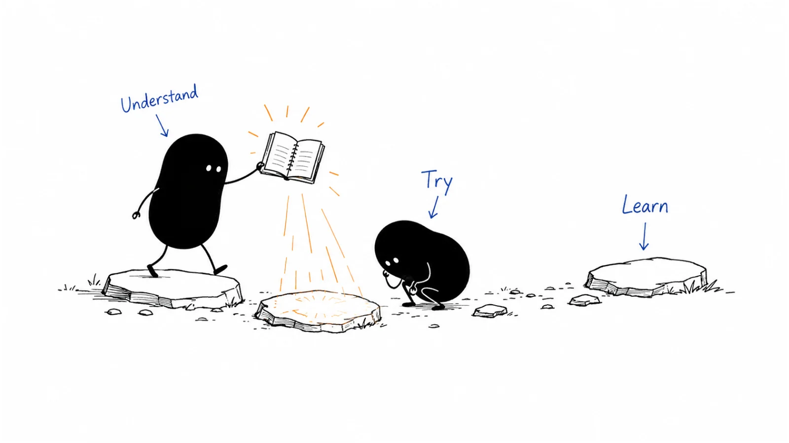

# B2B marketing playbook index

**Last reviewed:** 2026-09-03 · **Reading edit:** 2026-09-12

Find the guide for the task you are working on. Use the quick lookup below, or browse one of the nine chapters. All 131 topics in the original nine-chapter outline now have published guides.

If you are not sure where to start, try a [short reading path](../README.md#read-it-like-a-book). You can also browse [tools](../TOOLS.md), [working files](../TEMPLATES.md), or [reading sources](../RESOURCES.md).

Start with [a practical task path](start-here.md) if you want a guide, a template, and a worked example together.

## Fast finder

| Looking for | Domain | Playbook / status |
|---|---|---|
| Idea discovery | [Strategy & buyers](01-strategy-and-buyers/) | [Idea discovery](01-strategy-and-buyers/idea-discovery.md) |
| Idea validation | [Strategy & buyers](01-strategy-and-buyers/) | [Idea validation](01-strategy-and-buyers/idea-validation.md) |
| ICP | [Strategy & buyers](01-strategy-and-buyers/) | [Ideal customer profile](01-strategy-and-buyers/icp.md) |
| Wedge / first niche | [Strategy & buyers](01-strategy-and-buyers/) | [Wedge](01-strategy-and-buyers/wedge.md) |
| Buying committee | [Strategy & buyers](01-strategy-and-buyers/) | [Buying committee](01-strategy-and-buyers/buying-committee.md) |
| First 10 customers | [Strategy & buyers](01-strategy-and-buyers/) | [First ten customers](01-strategy-and-buyers/first-ten-customers.md) |
| Product-market fit | [Strategy & buyers](01-strategy-and-buyers/) | [Product-market fit](01-strategy-and-buyers/product-market-fit.md) |
| Four Fits / channel vs model | [Strategy & buyers](01-strategy-and-buyers/) | [Four Fits](01-strategy-and-buyers/four-fits.md) |
| Positioning | [Product marketing](02-product-marketing/) | [Positioning](02-product-marketing/positioning.md) |
| Messaging / message hierarchy | [Product marketing](02-product-marketing/) | [Messaging](02-product-marketing/messaging.md) |
| Competitive intel / battlecard | [Product marketing](02-product-marketing/) | [Competitive intelligence](02-product-marketing/competitive-intelligence.md) |
| Product launch / launch tier | [Product marketing](02-product-marketing/) | [Product launch](02-product-marketing/product-launch.md) |
| Pricing | [Product marketing](02-product-marketing/) | [Pricing and packaging](02-product-marketing/pricing-and-packaging.md) |
| Sales pitch | [Product marketing](02-product-marketing/) | [Sales enablement](02-product-marketing/sales-enablement.md) |
| Demo / product walk | [Product marketing](02-product-marketing/) | [Demo](02-product-marketing/demo.md) |
| Crowded category / friction of the fix | [Product marketing](02-product-marketing/) | [Change friction](02-product-marketing/change-friction.md) |
| Content strategy | [Brand, story & content](03-brand-story-and-content/) | [Content strategy](03-brand-story-and-content/content-strategy.md) |
| Case study / customer proof | [Brand, story & content](03-brand-story-and-content/) | [Case study](03-brand-story-and-content/case-study.md) |
| Founder story | [Brand, story & content](03-brand-story-and-content/) | [Founder story](03-brand-story-and-content/founder-story.md) |
| White paper | [Brand, story & content](03-brand-story-and-content/) | [White paper](03-brand-story-and-content/white-paper.md) |
| Community (owned) | [Brand, story & content](03-brand-story-and-content/) | [Community-led growth](03-brand-story-and-content/community-led-growth.md) |
| Community participation / hosting | [Channels & distribution](04-channels-and-distribution/) | [Community](04-channels-and-distribution/community.md) |
| Channel strategy / PLG vs sales | [Channels & distribution](04-channels-and-distribution/) | [Channel strategy](04-channels-and-distribution/channel-strategy.md) |
| SEO / AEO / AI search visibility | [Channels & distribution](04-channels-and-distribution/) | [SEO and AEO](04-channels-and-distribution/seo-and-aeo.md) |
| Newsletter / podcast / KOL partnership | [Channels & distribution](04-channels-and-distribution/) | [Creator partnership](04-channels-and-distribution/creator-partnership.md) |
| Product Hunt / launch day | [Channels & distribution](04-channels-and-distribution/) | [Product Hunt](04-channels-and-distribution/product-hunt.md) |
| Content syndication | [Channels & distribution](04-channels-and-distribution/) | [Content syndication](04-channels-and-distribution/content-syndication.md) |
| LinkedIn content | [Channels & distribution](04-channels-and-distribution/) | [LinkedIn organic](04-channels-and-distribution/linkedin-organic.md) |
| Paid ads / creation vs capture | [Channels & distribution](04-channels-and-distribution/) | [Paid media](04-channels-and-distribution/paid-media.md) |
| Review sites / G2 / buyer-visible reviews | [Channels & distribution](04-channels-and-distribution/) | [Review sites](04-channels-and-distribution/review-sites.md) |
| LinkedIn prospecting | [Outbound & prospecting](05-outbound-and-prospecting/) | [LinkedIn outbound](05-outbound-and-prospecting/linkedin-outbound.md) |
| Account research | [Outbound & prospecting](05-outbound-and-prospecting/) | [Account research](05-outbound-and-prospecting/account-research.md) |
| Buying signal / job change / which sentence | [Outbound & prospecting](05-outbound-and-prospecting/) | [Buying signals](05-outbound-and-prospecting/buying-signals.md) |
| Message-market fit / before AI SDR | [Outbound & prospecting](05-outbound-and-prospecting/) | [Message-market fit](05-outbound-and-prospecting/message-market-fit.md) |
| Cold email | [Outbound & prospecting](05-outbound-and-prospecting/) | [Cold email](05-outbound-and-prospecting/cold-email.md) |
| Phone / mobile data quality | [Outbound & prospecting](05-outbound-and-prospecting/) | [Contact data](05-outbound-and-prospecting/contact-data.md) |
| Cold call | [Outbound & prospecting](05-outbound-and-prospecting/) | [Cold call](05-outbound-and-prospecting/cold-call.md) |
| Multichannel sequence | [Outbound & prospecting](05-outbound-and-prospecting/) | [Multichannel sequence](05-outbound-and-prospecting/multichannel-sequence.md) |
| SDR / BDR onboarding | [Outbound & prospecting](05-outbound-and-prospecting/) | [SDR onboarding](05-outbound-and-prospecting/sdr-onboarding.md) |
| Event | [Account, field & partner](06-account-field-and-partner/) | [Event marketing](06-account-field-and-partner/event-marketing.md) |
| Trade show | [Account, field & partner](06-account-field-and-partner/) | [Trade shows](06-account-field-and-partner/trade-shows.md) |
| Dinner / roundtable | [Account, field & partner](06-account-field-and-partner/) | [Executive dinners](06-account-field-and-partner/executive-dinners.md) |
| Ecosystem / partners | [Account, field & partner](06-account-field-and-partner/) | [Ecosystem](06-account-field-and-partner/ecosystem.md) |
| Account planning / named-account 30/60/90 | [Account, field & partner](06-account-field-and-partner/) | [Account planning](06-account-field-and-partner/account-planning.md) |
| ABM / account-driven / account tiers | [Account, field & partner](06-account-field-and-partner/) | [ABM strategy](06-account-field-and-partner/abm-strategy.md) |
| Affiliate | [Account, field & partner](06-account-field-and-partner/) | [Affiliate program](06-account-field-and-partner/affiliate-program.md) |
| Homepage | [Website & conversion](07-website-and-conversion/) | [Homepage](07-website-and-conversion/homepage.md) |
| Comparison page | [Website & conversion](07-website-and-conversion/) | [Comparison page](07-website-and-conversion/comparison-page.md) |
| Pricing page | [Website & conversion](07-website-and-conversion/) | [Pricing page](07-website-and-conversion/pricing-page.md) |
| Demo request / high-intent form | [Website & conversion](07-website-and-conversion/) | [Demo request](07-website-and-conversion/demo-request.md) |
| Landing page / campaign URL | [Website & conversion](07-website-and-conversion/) | [Landing page](07-website-and-conversion/landing-page.md) |
| Forms / chat / what to collect | [Website & conversion](07-website-and-conversion/) | [Forms and chat](07-website-and-conversion/forms-and-chat.md) |
| Lead nurture / pre-sale drip | [Lifecycle & customer](08-lifecycle-and-customer-marketing/) | [Lead nurture](08-lifecycle-and-customer-marketing/lead-nurture.md) |
| Expansion / upsell / land and expand | [Lifecycle & customer](08-lifecycle-and-customer-marketing/) | [Expansion marketing](08-lifecycle-and-customer-marketing/expansion-marketing.md) |
| Renewal / value packet / horizon clock | [Lifecycle & customer](08-lifecycle-and-customer-marketing/) | [Renewal marketing](08-lifecycle-and-customer-marketing/renewal-marketing.md) |
| Measurement / attribution / HDYHAU | [Operations, pipeline & measurement](09-operations-pipeline-and-measurement/) | [Measurement model](09-operations-pipeline-and-measurement/measurement-model.md) |
| Customer success / post-sale book | [Lifecycle & customer](08-lifecycle-and-customer-marketing/) | [Customer success](08-lifecycle-and-customer-marketing/customer-success.md) |
| Customer onboarding / first value | [Lifecycle & customer](08-lifecycle-and-customer-marketing/) | [Customer onboarding](08-lifecycle-and-customer-marketing/customer-onboarding.md) |
| Onboarding packet / welcome messages | [Lifecycle & customer](08-lifecycle-and-customer-marketing/) | [Onboarding communication](08-lifecycle-and-customer-marketing/onboarding-communication.md) |
| CCO / VP CS first 90 days | [Lifecycle & customer](08-lifecycle-and-customer-marketing/) | [CS-leadership ramp](08-lifecycle-and-customer-marketing/cs-leadership-ramp.md) |
| CS CRM fields / health / 4Rs | [Lifecycle & customer](08-lifecycle-and-customer-marketing/) | [CS workspace](08-lifecycle-and-customer-marketing/cs-workspace.md) |
| Gross vs net revenue churn / NRR leak | [Lifecycle & customer](08-lifecycle-and-customer-marketing/) | [Revenue churn](08-lifecycle-and-customer-marketing/revenue-churn.md) |
| Customer community | [Lifecycle & customer](08-lifecycle-and-customer-marketing/) | [Customer community](08-lifecycle-and-customer-marketing/customer-community.md) |
| Sales compensation / quota pay | [Operations, pipeline & measurement](09-operations-pipeline-and-measurement/) | [Sales compensation](09-operations-pipeline-and-measurement/sales-compensation.md) |
| Forecast / pipeline hygiene | [Operations, pipeline & measurement](09-operations-pipeline-and-measurement/) | [Forecasting](09-operations-pipeline-and-measurement/forecasting.md) |
| Lead scoring / MQL | [Operations, pipeline & measurement](09-operations-pipeline-and-measurement/) | [Lead scoring](09-operations-pipeline-and-measurement/lead-scoring.md) |
| GTM plan / capacity vs demand | [Operations, pipeline & measurement](09-operations-pipeline-and-measurement/) | [GTM planning](09-operations-pipeline-and-measurement/gtm-planning.md) |
| Marketing budget / monthly headcount | [Operations, pipeline & measurement](09-operations-pipeline-and-measurement/) | [Budget and planning](09-operations-pipeline-and-measurement/budget-and-planning.md) |
| First marketer / marketing org / π-shape | [Operations, pipeline & measurement](09-operations-pipeline-and-measurement/) | [Marketing org](09-operations-pipeline-and-measurement/marketing-org.md) |
| VP Sales / sales-leader 90 days | [Operations, pipeline & measurement](09-operations-pipeline-and-measurement/) | [Sales-leadership ramp](09-operations-pipeline-and-measurement/sales-leadership-ramp.md) |
| CRM fields / migration map | [Operations, pipeline & measurement](09-operations-pipeline-and-measurement/) | [CRM data model](09-operations-pipeline-and-measurement/crm-data-model.md) |
| MarTech / vendor bake-off | [Operations, pipeline & measurement](09-operations-pipeline-and-measurement/) | [MarTech governance](09-operations-pipeline-and-measurement/martech-governance.md) |
| Sales meetings / 13-week cadence | [Operations, pipeline & measurement](09-operations-pipeline-and-measurement/) | [Sales operating cadence](09-operations-pipeline-and-measurement/sales-operating-cadence.md) |
| Company cadence / launch vs close | [Operations, pipeline & measurement](09-operations-pipeline-and-measurement/) | [Company cadence](09-operations-pipeline-and-measurement/company-cadence.md) |
| Clawbacks / draws / holdbacks | [Operations, pipeline & measurement](09-operations-pipeline-and-measurement/) | [Incentive timing](09-operations-pipeline-and-measurement/incentive-timing.md) |
| RevOps / sales-ops leader pay | [Operations, pipeline & measurement](09-operations-pipeline-and-measurement/) | [RevOps compensation](09-operations-pipeline-and-measurement/revops-compensation.md) |
| GTM tests / hypotheses | [Operations, pipeline & measurement](09-operations-pipeline-and-measurement/) | [Experimentation](09-operations-pipeline-and-measurement/experimentation.md) |
| GTM AI ladder / “we are AI-native” | [Operations, pipeline & measurement](09-operations-pipeline-and-measurement/) | [GTM AI maturity](09-operations-pipeline-and-measurement/gtm-ai-maturity.md) |
| Which AI use case / not which tool | [Operations, pipeline & measurement](09-operations-pipeline-and-measurement/) | [AI use-case selection](09-operations-pipeline-and-measurement/ai-use-case-selection.md) |
| AI workflow / agent gates | [Operations, pipeline & measurement](09-operations-pipeline-and-measurement/) | [AI workflow](09-operations-pipeline-and-measurement/ai-workflow.md) |
| Pipeline | [Operations, pipeline & measurement](09-operations-pipeline-and-measurement/) | [Pipeline model](09-operations-pipeline-and-measurement/pipeline-model.md) |

| Market research | [Strategy & buyers](01-strategy-and-buyers/) | [Market research](01-strategy-and-buyers/market-research.md) |
| Segmentation | [Strategy & buyers](01-strategy-and-buyers/) | [Segmentation](01-strategy-and-buyers/segmentation.md) |
| Buyer journey | [Strategy & buyers](01-strategy-and-buyers/) | [Buyer journey](01-strategy-and-buyers/buyer-journey.md) |
| Jobs to be done | [Strategy & buyers](01-strategy-and-buyers/) | [Jobs to be done](01-strategy-and-buyers/jobs-to-be-done.md) |
| Category entry points | [Strategy & buyers](01-strategy-and-buyers/) | [Category entry points](01-strategy-and-buyers/category-entry-points.md) |
| Competitive alternatives | [Strategy & buyers](01-strategy-and-buyers/) | [Competitive alternatives](01-strategy-and-buyers/competitive-alternatives.md) |
| Value proposition | [Product marketing](02-product-marketing/) | [Value proposition](02-product-marketing/value-proposition.md) |
| Proof and claims | [Product marketing](02-product-marketing/) | [Proof and claims](02-product-marketing/proof-and-claims.md) |
| Brand strategy | [Brand, story & content](03-brand-story-and-content/) | [Brand strategy](03-brand-story-and-content/brand-strategy.md) |
| Brand narrative | [Brand, story & content](03-brand-story-and-content/) | [Brand narrative](03-brand-story-and-content/brand-narrative.md) |
| Thought leadership | [Brand, story & content](03-brand-story-and-content/) | [Thought leadership](03-brand-story-and-content/thought-leadership.md) |
| Newsletter | [Brand, story & content](03-brand-story-and-content/) | [Newsletter](03-brand-story-and-content/newsletter.md) |
| Webinar | [Brand, story & content](03-brand-story-and-content/) | [Webinar](03-brand-story-and-content/webinar.md) |
| Podcast | [Brand, story & content](03-brand-story-and-content/) | [Podcast](03-brand-story-and-content/podcast.md) |
| Video | [Brand, story & content](03-brand-story-and-content/) | [Video](03-brand-story-and-content/video.md) |
| Paid search | [Channels & distribution](04-channels-and-distribution/) | [Paid search](04-channels-and-distribution/paid-search.md) |
| Paid social | [Channels & distribution](04-channels-and-distribution/) | [Paid social](04-channels-and-distribution/paid-social.md) |
| Retargeting | [Channels & distribution](04-channels-and-distribution/) | [Retargeting](04-channels-and-distribution/retargeting.md) |
| PR and media | [Channels & distribution](04-channels-and-distribution/) | [PR and media](04-channels-and-distribution/pr-and-media.md) |
| Content distribution | [Channels & distribution](04-channels-and-distribution/) | [Content distribution](04-channels-and-distribution/content-distribution.md) |
| Content repurposing | [Channels & distribution](04-channels-and-distribution/) | [Content repurposing](04-channels-and-distribution/content-repurposing.md) |
| Contact research | [Outbound & prospecting](05-outbound-and-prospecting/) | [Contact research](05-outbound-and-prospecting/contact-research.md) |
| Email deliverability | [Outbound & prospecting](05-outbound-and-prospecting/) | [Email deliverability](05-outbound-and-prospecting/email-deliverability.md) |
| Reply handling | [Outbound & prospecting](05-outbound-and-prospecting/) | [Reply handling](05-outbound-and-prospecting/reply-handling.md) |
| SDR handoff | [Outbound & prospecting](05-outbound-and-prospecting/) | [SDR handoff](05-outbound-and-prospecting/sdr-handoff.md) |
| One-to-one ABM | [Account, field & partner marketing](06-account-field-and-partner/) | [One-to-one ABM](06-account-field-and-partner/one-to-one-abm.md) |
| One-to-few ABM | [Account, field & partner marketing](06-account-field-and-partner/) | [One-to-few ABM](06-account-field-and-partner/one-to-few-abm.md) |
| Direct mail | [Account, field & partner marketing](06-account-field-and-partner/) | [Direct mail](06-account-field-and-partner/direct-mail.md) |
| Partner marketing | [Account, field & partner marketing](06-account-field-and-partner/) | [Partner marketing](06-account-field-and-partner/partner-marketing.md) |
| Channel marketing | [Account, field & partner marketing](06-account-field-and-partner/) | [Channel marketing](06-account-field-and-partner/channel-marketing.md) |
| Co-marketing | [Account, field & partner marketing](06-account-field-and-partner/) | [Co-marketing](06-account-field-and-partner/co-marketing.md) |
| Website strategy | [Website & conversion](07-website-and-conversion/) | [Website strategy](07-website-and-conversion/website-strategy.md) |
| Product page | [Website & conversion](07-website-and-conversion/) | [Product page](07-website-and-conversion/product-page.md) |
| Documentation and resource center | [Website & conversion](07-website-and-conversion/) | [Documentation and resource center](07-website-and-conversion/documentation.md) |
| Lead magnet | [Website & conversion](07-website-and-conversion/) | [Lead magnet](07-website-and-conversion/lead-magnet.md) |
| Conversion-rate optimization | [Website & conversion](07-website-and-conversion/) | [Conversion-rate optimization](07-website-and-conversion/conversion-rate-optimization.md) |
| Self-service buying | [Website & conversion](07-website-and-conversion/) | [Self-service buying](07-website-and-conversion/self-service-buying.md) |
| Lifecycle email | [Lifecycle & customer marketing](08-lifecycle-and-customer-marketing/) | [Lifecycle email](08-lifecycle-and-customer-marketing/lifecycle-email.md) |
| Customer education | [Lifecycle & customer marketing](08-lifecycle-and-customer-marketing/) | [Customer education](08-lifecycle-and-customer-marketing/customer-education.md) |
| Customer advocacy | [Lifecycle & customer marketing](08-lifecycle-and-customer-marketing/) | [Customer advocacy](08-lifecycle-and-customer-marketing/customer-advocacy.md) |
| Referral program | [Lifecycle & customer marketing](08-lifecycle-and-customer-marketing/) | [Referral program](08-lifecycle-and-customer-marketing/referral-program.md) |
| Review program | [Lifecycle & customer marketing](08-lifecycle-and-customer-marketing/) | [Review program](08-lifecycle-and-customer-marketing/review-program.md) |
| Win-back | [Lifecycle & customer marketing](08-lifecycle-and-customer-marketing/) | [Win-back](08-lifecycle-and-customer-marketing/win-back.md) |
| Funnel model | [Operations, pipeline & measurement](09-operations-pipeline-and-measurement/) | [Funnel model](09-operations-pipeline-and-measurement/funnel-model.md) |
| Lifecycle stages | [Operations, pipeline & measurement](09-operations-pipeline-and-measurement/) | [Lifecycle stages](09-operations-pipeline-and-measurement/lifecycle-stages.md) |
| Account scoring | [Operations, pipeline & measurement](09-operations-pipeline-and-measurement/) | [Account scoring](09-operations-pipeline-and-measurement/account-scoring.md) |
| Routing and SLA | [Operations, pipeline & measurement](09-operations-pipeline-and-measurement/) | [Routing and SLA](09-operations-pipeline-and-measurement/routing-and-sla.md) |
| Attribution | [Operations, pipeline & measurement](09-operations-pipeline-and-measurement/) | [Attribution](09-operations-pipeline-and-measurement/attribution.md) |
| Dashboards | [Operations, pipeline & measurement](09-operations-pipeline-and-measurement/) | [Dashboards](09-operations-pipeline-and-measurement/dashboards.md) |
| Privacy and compliance operations | [Operations, pipeline & measurement](09-operations-pipeline-and-measurement/) | [Privacy and compliance operations](09-operations-pipeline-and-measurement/privacy-and-compliance-operations.md) |

## 01 · [Strategy & buyers](01-strategy-and-buyers/)

**Decision:** Where should the company compete, which organizations and people matter, and how do they buy?

Published:

- [Idea discovery](01-strategy-and-buyers/idea-discovery.md)
- [Idea validation](01-strategy-and-buyers/idea-validation.md)
- [Ideal customer profile](01-strategy-and-buyers/icp.md)
- [Wedge](01-strategy-and-buyers/wedge.md)
- [Buying committee](01-strategy-and-buyers/buying-committee.md)
- [First ten customers](01-strategy-and-buyers/first-ten-customers.md)
- [Product-market fit](01-strategy-and-buyers/product-market-fit.md)
- [Four Fits](01-strategy-and-buyers/four-fits.md)

- [Market research](01-strategy-and-buyers/market-research.md)
- [Segmentation](01-strategy-and-buyers/segmentation.md)
- [Buyer journey](01-strategy-and-buyers/buyer-journey.md)
- [Jobs to be done](01-strategy-and-buyers/jobs-to-be-done.md)
- [Category entry points](01-strategy-and-buyers/category-entry-points.md)
- [Competitive alternatives](01-strategy-and-buyers/competitive-alternatives.md)

## 02 · [Product marketing](02-product-marketing/)

**Decision:** What should the market understand, believe, compare, and buy?

Published:

- [Positioning](02-product-marketing/positioning.md)
- [Messaging](02-product-marketing/messaging.md)
- [Competitive intelligence](02-product-marketing/competitive-intelligence.md)
- [Product launch](02-product-marketing/product-launch.md)
- [Pricing and packaging](02-product-marketing/pricing-and-packaging.md)
- [Sales enablement](02-product-marketing/sales-enablement.md)
- [Demo](02-product-marketing/demo.md)
- [Change friction](02-product-marketing/change-friction.md)

- [Value proposition](02-product-marketing/value-proposition.md)
- [Proof and claims](02-product-marketing/proof-and-claims.md)

## 03 · [Brand, story & content](03-brand-story-and-content/)

**Decision:** How will future buyers remember, trust, and learn from the company before they are in market?

Published:

- [Content strategy](03-brand-story-and-content/content-strategy.md)
- [Founder story](03-brand-story-and-content/founder-story.md)
- [Case study](03-brand-story-and-content/case-study.md)
- [White paper](03-brand-story-and-content/white-paper.md)

- [Brand strategy](03-brand-story-and-content/brand-strategy.md)
- [Brand narrative](03-brand-story-and-content/brand-narrative.md)
- [Thought leadership](03-brand-story-and-content/thought-leadership.md)
- [Newsletter](03-brand-story-and-content/newsletter.md)
- [Webinar](03-brand-story-and-content/webinar.md)
- [Podcast](03-brand-story-and-content/podcast.md)
- [Video](03-brand-story-and-content/video.md)
- [Community-led growth](03-brand-story-and-content/community-led-growth.md)

## 04 · [Channels & distribution](04-channels-and-distribution/)

**Decision:** Where and how will the market repeatedly encounter the company's ideas and offers?

Published:

- [Channel strategy](04-channels-and-distribution/channel-strategy.md)
- [SEO and AEO](04-channels-and-distribution/seo-and-aeo.md)
- [Community](04-channels-and-distribution/community.md)
- [Creator partnership](04-channels-and-distribution/creator-partnership.md)
- [Product Hunt](04-channels-and-distribution/product-hunt.md)
- [Content syndication](04-channels-and-distribution/content-syndication.md)
- [LinkedIn organic](04-channels-and-distribution/linkedin-organic.md)
- [Paid media](04-channels-and-distribution/paid-media.md)
- [Review sites](04-channels-and-distribution/review-sites.md)

- [Paid search](04-channels-and-distribution/paid-search.md)
- [Paid social](04-channels-and-distribution/paid-social.md)
- [Retargeting](04-channels-and-distribution/retargeting.md)
- [PR and media](04-channels-and-distribution/pr-and-media.md)
- [Content distribution](04-channels-and-distribution/content-distribution.md)
- [Content repurposing](04-channels-and-distribution/content-repurposing.md)

## 05 · [Outbound & prospecting](05-outbound-and-prospecting/)

**Decision:** How will the team create relevant conversations with accounts that have not raised a hand?

Published:

- [Account research](05-outbound-and-prospecting/account-research.md)
- [Buying signals](05-outbound-and-prospecting/buying-signals.md)
- [Message-market fit](05-outbound-and-prospecting/message-market-fit.md)
- [Cold email](05-outbound-and-prospecting/cold-email.md)
- [Multichannel sequence](05-outbound-and-prospecting/multichannel-sequence.md)
- [SDR onboarding](05-outbound-and-prospecting/sdr-onboarding.md)
- [Contact data](05-outbound-and-prospecting/contact-data.md)
- [Cold call](05-outbound-and-prospecting/cold-call.md)
- [LinkedIn outbound](05-outbound-and-prospecting/linkedin-outbound.md)

- [Contact research](05-outbound-and-prospecting/contact-research.md)
- [Email deliverability](05-outbound-and-prospecting/email-deliverability.md)
- [Reply handling](05-outbound-and-prospecting/reply-handling.md)
- [SDR handoff](05-outbound-and-prospecting/sdr-handoff.md)

## 06 · [Account, field & partner marketing](06-account-field-and-partner/)

**Decision:** How will marketing and sales coordinate around high-value accounts, physical access, and ecosystem leverage?

Published:

- [Event marketing](06-account-field-and-partner/event-marketing.md)
- [Trade shows](06-account-field-and-partner/trade-shows.md)
- [Executive dinners](06-account-field-and-partner/executive-dinners.md)
- [Ecosystem](06-account-field-and-partner/ecosystem.md)
- [Account planning](06-account-field-and-partner/account-planning.md)
- [ABM strategy](06-account-field-and-partner/abm-strategy.md)

- [One-to-one ABM](06-account-field-and-partner/one-to-one-abm.md)
- [One-to-few ABM](06-account-field-and-partner/one-to-few-abm.md)
- [Direct mail](06-account-field-and-partner/direct-mail.md)
- [Partner marketing](06-account-field-and-partner/partner-marketing.md)
- [Affiliate program](06-account-field-and-partner/affiliate-program.md)
- [Channel marketing](06-account-field-and-partner/channel-marketing.md)
- [Co-marketing](06-account-field-and-partner/co-marketing.md)

## 07 · [Website & conversion](07-website-and-conversion/)

**Decision:** How will owned digital experiences help buyers understand, evaluate, and take the next step?

Published:

- [Homepage](07-website-and-conversion/homepage.md)
- [Comparison page](07-website-and-conversion/comparison-page.md)
- [Pricing page](07-website-and-conversion/pricing-page.md)
- [Demo request](07-website-and-conversion/demo-request.md)
- [Landing page](07-website-and-conversion/landing-page.md)
- [Forms and chat](07-website-and-conversion/forms-and-chat.md)

- [Website strategy](07-website-and-conversion/website-strategy.md)
- [Product page](07-website-and-conversion/product-page.md)
- [Documentation and resource center](07-website-and-conversion/documentation.md)
- [Lead magnet](07-website-and-conversion/lead-magnet.md)
- [Conversion-rate optimization](07-website-and-conversion/conversion-rate-optimization.md)
- [Self-service buying](07-website-and-conversion/self-service-buying.md)

## 08 · [Lifecycle & customer marketing](08-lifecycle-and-customer-marketing/)

**Decision:** How will the company educate, retain, expand, and mobilize customers after initial interest or purchase?

Published:

- [Customer success](08-lifecycle-and-customer-marketing/customer-success.md)
- [Customer onboarding](08-lifecycle-and-customer-marketing/customer-onboarding.md)
- [Onboarding communication](08-lifecycle-and-customer-marketing/onboarding-communication.md)
- [CS-leadership ramp](08-lifecycle-and-customer-marketing/cs-leadership-ramp.md)
- [CS workspace](08-lifecycle-and-customer-marketing/cs-workspace.md)
- [Revenue churn](08-lifecycle-and-customer-marketing/revenue-churn.md)
- [Lead nurture](08-lifecycle-and-customer-marketing/lead-nurture.md)
- [Expansion marketing](08-lifecycle-and-customer-marketing/expansion-marketing.md)
- [Renewal marketing](08-lifecycle-and-customer-marketing/renewal-marketing.md)

- [Lifecycle email](08-lifecycle-and-customer-marketing/lifecycle-email.md)
- [Customer education](08-lifecycle-and-customer-marketing/customer-education.md)
- [Customer community](08-lifecycle-and-customer-marketing/customer-community.md)
- [Customer advocacy](08-lifecycle-and-customer-marketing/customer-advocacy.md)
- [Referral program](08-lifecycle-and-customer-marketing/referral-program.md)
- [Review program](08-lifecycle-and-customer-marketing/review-program.md)
- [Win-back](08-lifecycle-and-customer-marketing/win-back.md)

## 09 · [Operations, pipeline & measurement](09-operations-pipeline-and-measurement/)

**Decision:** How will data, process, technology, and measurement make the marketing system repeatable?

Published:

- [Sales compensation](09-operations-pipeline-and-measurement/sales-compensation.md)
- [Forecasting](09-operations-pipeline-and-measurement/forecasting.md)
- [Lead scoring](09-operations-pipeline-and-measurement/lead-scoring.md)
- [GTM planning](09-operations-pipeline-and-measurement/gtm-planning.md)
- [Budget and planning](09-operations-pipeline-and-measurement/budget-and-planning.md)
- [Marketing org](09-operations-pipeline-and-measurement/marketing-org.md)
- [Sales-leadership ramp](09-operations-pipeline-and-measurement/sales-leadership-ramp.md)
- [CRM data model](09-operations-pipeline-and-measurement/crm-data-model.md)
- [MarTech governance](09-operations-pipeline-and-measurement/martech-governance.md)
- [Sales operating cadence](09-operations-pipeline-and-measurement/sales-operating-cadence.md)
- [Company cadence](09-operations-pipeline-and-measurement/company-cadence.md)
- [Incentive timing](09-operations-pipeline-and-measurement/incentive-timing.md)
- [RevOps compensation](09-operations-pipeline-and-measurement/revops-compensation.md)
- [Experimentation](09-operations-pipeline-and-measurement/experimentation.md)
- [GTM AI maturity](09-operations-pipeline-and-measurement/gtm-ai-maturity.md)
- [AI use-case selection](09-operations-pipeline-and-measurement/ai-use-case-selection.md)
- [AI workflow](09-operations-pipeline-and-measurement/ai-workflow.md)
- [Measurement model](09-operations-pipeline-and-measurement/measurement-model.md)

- [Funnel model](09-operations-pipeline-and-measurement/funnel-model.md)
- [Pipeline model](09-operations-pipeline-and-measurement/pipeline-model.md)
- [Lifecycle stages](09-operations-pipeline-and-measurement/lifecycle-stages.md)
- [Account scoring](09-operations-pipeline-and-measurement/account-scoring.md)
- [Routing and SLA](09-operations-pipeline-and-measurement/routing-and-sla.md)
- [Attribution](09-operations-pipeline-and-measurement/attribution.md)
- [Dashboards](09-operations-pipeline-and-measurement/dashboards.md)
- [Privacy and compliance operations](09-operations-pipeline-and-measurement/privacy-and-compliance-operations.md)

## How to use the guides

Start with the situation and the example, then use the steps and checklist for your own work. The suggested scores and thresholds are starting points to test, not universal benchmarks. Each guide includes sources and a next reading link.

## Architecture rationale

- Long-term demand creation and short-term demand capture require different methods and measures. See the [LinkedIn B2B Institute](https://business.linkedin.com/advertise/resources/b2b-institute/cmo-scorecard?ref=b2b-playbook).
- B2B buyers move across digital, remote, and in-person touchpoints, so channel playbooks must connect to one buyer journey. See [McKinsey's 2026 B2B Pulse](https://www.mckinsey.com/capabilities/growth-marketing-and-sales/our-insights/the-surprising-economics-of-b2b-growth-the-new-survival-threshold-and-what-it-takes-to-thrive?ref=b2b-playbook).
- Account-based marketing coordinates marketing and sales across channels around selected accounts. See [Demandbase's ABM orchestration guide](https://www.demandbase.com/blog/abm-orchestration/?ref=b2b-playbook).

Third-party links use `ref=b2b-playbook` for referral-source identification only. The parameter is not an affiliate code or an endorsement signal.

This library focuses on marketing and the revenue work closely connected to it. Detailed contract negotiation and procurement execution are outside its scope.

---

Copyright © 2026 Ivan Xu. All rights reserved. See the [copyright and reuse terms](../LICENSE).

Canonical source: [github.com/weilun88313/B2B-Playbook](https://github.com/weilun88313/B2B-Playbook)
