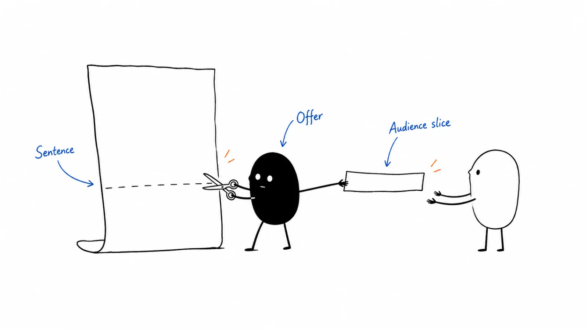

B2B Playbook working file. Read [message-market fit](../playbooks/05-outbound-and-prospecting/message-market-fit.md) first.

One slice. One offer. One handmade batch. Delete teaching notes. Do not paste a sequence or an agent as the proof.

Copyright © 2026 Ivan Xu. Private operating copy permitted. See LICENSE.

---

## Slice

- ICP slice and seat:
- Current alternative:
- Still passes ICP without a headline (yes / no):

## Offer

- Job we claim to finish (product name removed, still true?):
- What we will not claim:

## Sentence

- Evidence supporting the message (source / date; distinguish facts from assumptions):
- Context: first contact / requested follow-up / existing conversation:
- Opening tied to that evidence:
- One ask:

## Handmade batch

- Size / author / window / kill date:
- Qualified conversations:
- Repeating yes or repeating no:
- Pattern we believe:

## Scale gate

- Ready to repeat this approach? Evidence / remaining questions:
- If automation is proposed: permission, review, and stop conditions:
- What a sequence or agent may not change:
- Next test if this batch failed (change only one):
