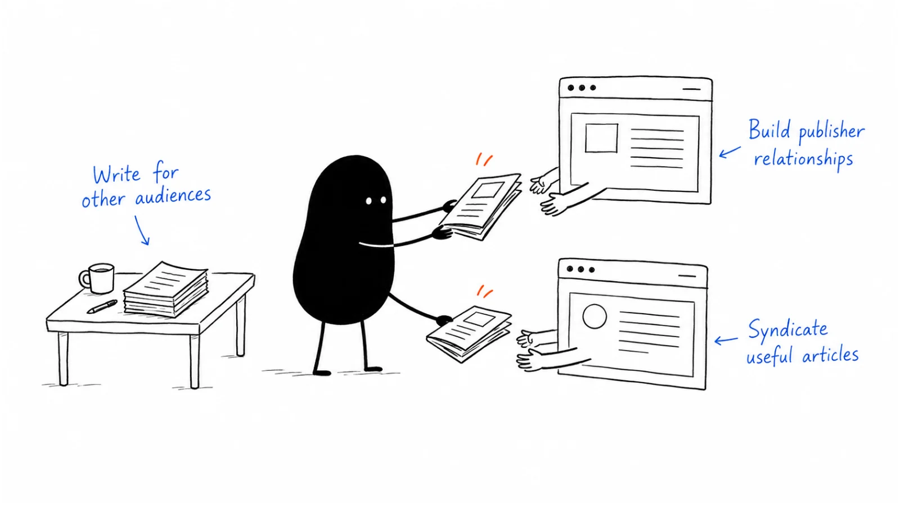

**Company:** Buffer · **Motion:** Guest writing and syndication · **Last reviewed:** 2026-09-06

## Primary record

Kevan Lee published [Buffer's guest blogging and syndication account](https://buffer.com/resources/how-to-become-a-columnist-guest-posting-syndication/?ref=b2b-playbook) on **2014-05-08**.

## What the company reported

Buffer describes roughly **150 guest posts in nine months**, building publisher relationships and a portfolio. It then offered successful articles for republication and maintained relationships with publishers such as Fast Company.

The article reports **949 new conversions** from its top four syndication sites in the preceding month. It does not define those conversions as paid customers.

## Evidence limit

These are historical, company-reported results from a different publishing environment. They do not establish today's channel economics or the return on each guest post. Editorial republication is distinct from buying gated-content leads.

## Our interpretation and a test

Choose one useful artifact and one publisher whose readers have the same problem. Offer an original short explanation and a link to the artifact, with a clear permission scope.

Measure accepted pitches, qualified visits, and actual uses. Repeat the winning topic with an appropriate new treatment. The transferable asset is a publisher relationship supported by useful work.

Continue with [creator partnership](../playbooks/04-channels-and-distribution/creator-partnership.md) and [content strategy](../playbooks/03-brand-story-and-content/content-strategy.md).

---

Copyright © 2026 Ivan Xu. All rights reserved. See the [copyright and reuse terms](https://github.com/weilun88313/B2B-Playbook/blob/main/LICENSE).

Canonical source: [github.com/weilun88313/B2B-Playbook](https://github.com/weilun88313/B2B-Playbook)

