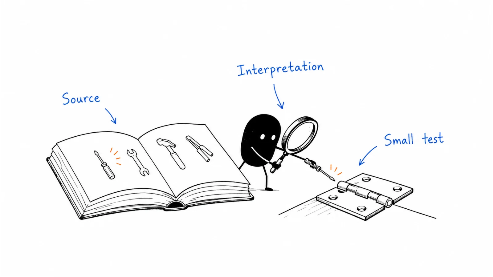

**Last reviewed:** 2026-09-06

Three named companies, three specific growth motions. Each case separates what a primary source reports from our interpretation and a suggested test. “Source-checked” means the account and date were checked; company-reported outcomes have not been independently audited.

| Company | Motion | Reported result | Read |
|---|---|---|---|
| PostHog | Early users followed by a public developer launch | 300 deployments within days of its Hacker News launch | [Launch after usability](https://b2-b-playbook.mintlify.app/use-cases/posthog-launch) |
| Buffer | Guest writing followed by syndication | 949 conversions from four syndication partners in the month described | [Earn distribution relationships](https://b2-b-playbook.mintlify.app/use-cases/buffer-syndication) |
| Zapier | Find integration requests and sell before building | First paying customers; exact acquisition count not supplied | [Start with a stated need](https://b2-b-playbook.mintlify.app/use-cases/zapier-first-customers) |

These are historical cases. A deployment, conversion, paying customer, and GitHub star are different outcomes. Use the mechanism to design a small test; do not copy an old channel result into a forecast.

[Playbooks](../playbooks/README.md) · [Tools](../TOOLS.md)

---

Copyright © 2026 Ivan Xu. All rights reserved. See the [copyright and reuse terms](https://github.com/weilun88313/B2B-Playbook/blob/main/LICENSE).

Canonical source: [github.com/weilun88313/B2B-Playbook](https://github.com/weilun88313/B2B-Playbook)

