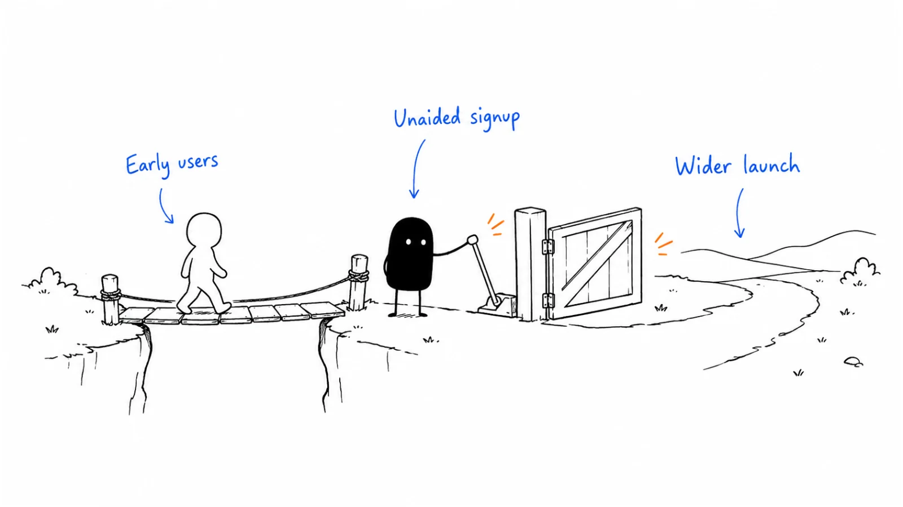

**Company:** PostHog · **Motion:** Developer launch · **Last reviewed:** 2026-09-06

## Primary record

James Hawkins, PostHog co-founder, published [How we got our first 1,000 users](https://newsletter.posthog.com/p/how-we-got-our-first-1000-users?ref=b2b-playbook) on **2024-06-20**, looking back at the company's early months.

## What the company reported

The team first recruited users through people they knew, introductions, groups, and LinkedIn. Its launch gate was practical: people could sign up without help, and strangers found the product useful.

Hawkins reports **300 deployments within a couple of days** of launching on Hacker News, five weeks after starting. He also reports about **&#36;2,000 of Twitter promotion** alongside the launch and says the repository reached GitHub Trending.

## Evidence limit

This is a founder's retrospective. Deployments are not paying customers or stars. The article does not isolate paid promotion from launch effects or establish a repeatable Trending formula.

## Our interpretation and a test

For a knowledge library, ask five unfamiliar readers to complete one task unaided. Record where they get stuck and the artifact they produce. Fix those failures before a broad launch.

Track completed tasks, repository visitors, and stars separately. Evaluate a public launch only when the demonstration is useful to that venue's audience.

Continue with [Product Hunt](../playbooks/04-channels-and-distribution/product-hunt.md) for launch boundaries and [measurement](../playbooks/09-operations-pipeline-and-measurement/measurement-model.md) for separate scoreboards.

---

Copyright © 2026 Ivan Xu. All rights reserved. See the [copyright and reuse terms](../LICENSE).

Canonical source: [github.com/weilun88313/B2B-Playbook](https://github.com/weilun88313/B2B-Playbook)

