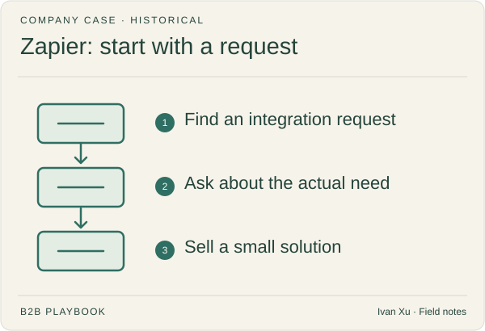

**Company:** Zapier · **Motion:** Founder outreach from demand signals · **Last reviewed:** 2026-09-06

## Primary record

Co-founder Bryan Helmig published [Zapier's early paying-customer account](https://zapier.com/blog/3-dudes-missouri-built-product-found-paying-customers-and-got-yc/?ref=b2b-playbook) on **2012-10-30**.

## What the company reported

After a prototype and an unsuccessful YC application, the founders searched support forums for integration requests. They contacted people who had described a need, explained the intended product, and built it when a person agreed to a paid plan.

Helmig describes acquiring early paying customers this way and later applying successfully to YC. The article supplies no exact acquisition count, conversion rate, or revenue attributable to forum outreach.

## Evidence limit

This is a founder's account of early discovery and sales, not a controlled channel comparison. A public request is evidence of a problem, not blanket permission for repeated unsolicited messages.

## Our interpretation and a test

Collect ten recent requests for the same task in a community where you may participate. Write down the current workaround and what a useful answer would contain. Contribute a complete answer; link an artifact when relevant and allowed.

For a knowledge library, count useful replies and completed tasks before expanding the effort. Do not equate a complaint with purchase intent.

Continue with [first ten customers](../playbooks/01-strategy-and-buyers/first-ten-customers.md) and [buying signals](../playbooks/05-outbound-and-prospecting/buying-signals.md).

---

Copyright © 2026 Ivan Xu. All rights reserved. See the [copyright and reuse terms](../LICENSE).

Canonical source: [github.com/weilun88313/B2B-Playbook](https://github.com/weilun88313/B2B-Playbook)

